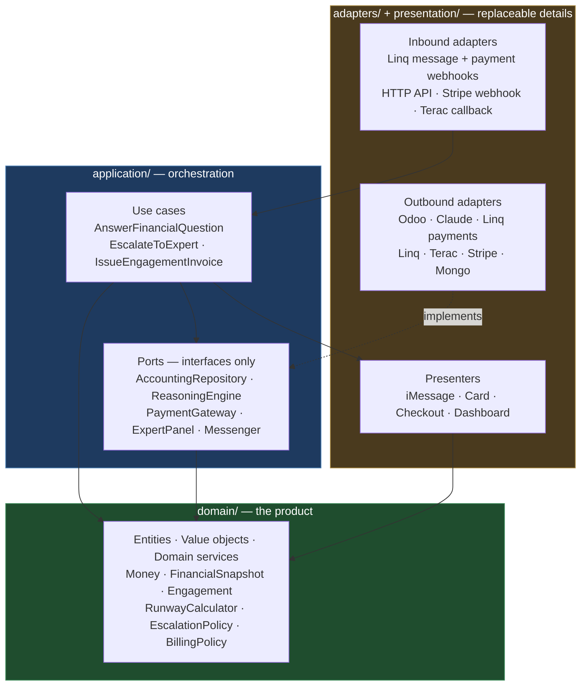
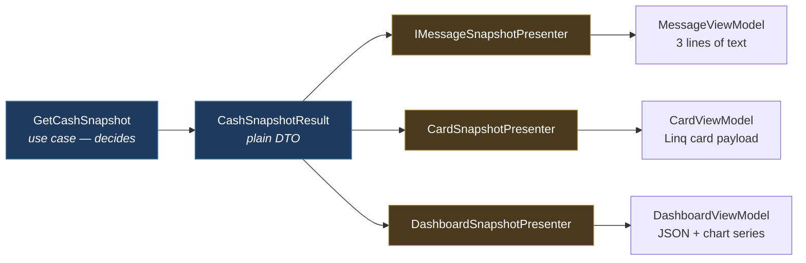
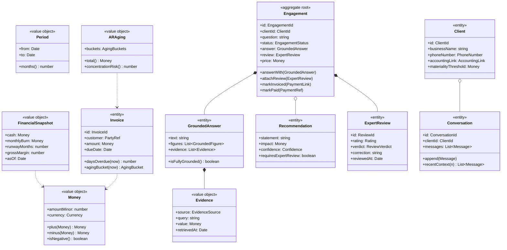
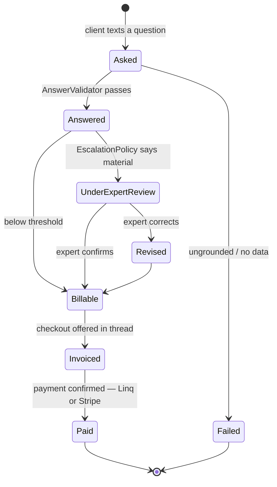
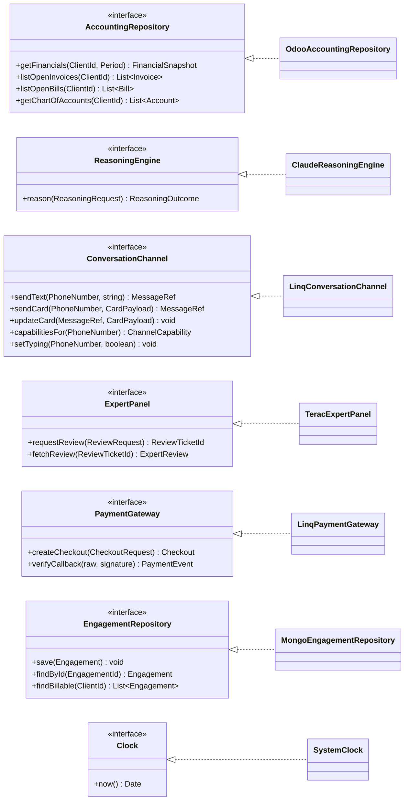
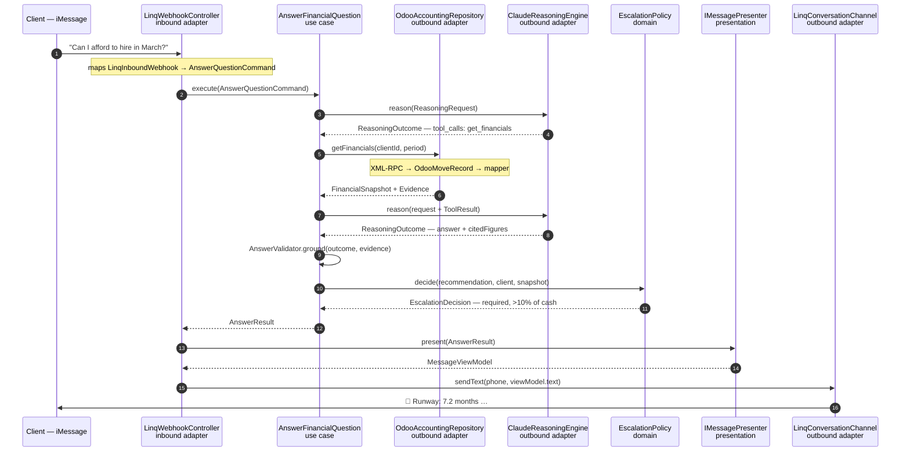
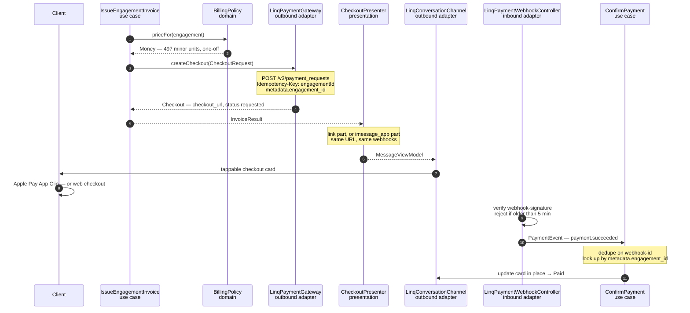

# Architecture — Tamoa

How the code is organised: the layers, the classes, the interfaces between them, and the data that
crosses each boundary.

Stack decisions live in [tech_stack.md](./tech_stack.md). Product scope lives in
[product_demo.md](./product_demo.md). **This doc is the shape of the code.**

> **Naming:** **Tamoa** = the product · **Tammy** = the agent the owner texts
> ([imessage_flow.md](./imessage_flow.md)). Class and folder names below are Tamoa's internals;
> "Tammy" appears only where the client-facing agent is meant.

Runtime: **TypeScript / Node**, one language across the agent service and the dashboard API.

---

## 1. The one rule

> **Business logic depends on nothing. Everything depends on business logic.**

Odoo, Claude, Stripe, Linq, Terac and Mongo are all _replaceable details_. The rules of a fractional
CFO — what runway means, when advice is material enough to need a human, when work becomes billable
— are the product. If swapping Odoo for QuickBooks means editing a file that contains the word
"runway", the architecture has failed.

Everything below is machinery for enforcing that one sentence.



Every solid arrow points **inward**. The only arrow pointing outward-ish is the dashed `implements`
— and that's the trick: `LinqPaymentGateway` lives in the outer ring but _conforms to_ an
interface owned by the inner ring. That inversion is what lets the centre stay ignorant of both
Apple Pay and Stripe.

### Enforcing it mechanically

Don't rely on discipline. Put this in `.eslintrc` and let CI fail the build:

```jsonc
// eslint: no-restricted-imports, applied per-directory
{
  "overrides": [
    {
      "files": ["src/domain/**"],
      "rules": {
        "no-restricted-imports": [
          "error",
          {
            "patterns": [
              "**/application/**",
              "**/adapters/**",
              "**/presentation/**",
              "@anthropic-ai/*",
              "stripe",
              "mongodb",
              "axios",
              "express",
            ],
          },
        ],
      },
    },
    {
      "files": ["src/application/**"],
      "rules": {
        "no-restricted-imports": [
          "error",
          {
            "patterns": [
              "**/adapters/**",
              "**/presentation/**",
              "@anthropic-ai/*",
              "stripe",
              "mongodb",
              "express",
            ],
          },
        ],
      },
    },
  ],
}
```

If `src/domain` has zero runtime dependencies in `package.json` terms, you've won. A useful smoke
test: **the domain folder should compile and its tests should pass with the network unplugged and no
environment variables set.**

---

## 2. Module map

```
src/
├── domain/                      ← zero dependencies. Pure TypeScript.
│   ├── model/                   Entities & value objects
│   │   ├── Money.ts             Period.ts  Ids.ts
│   │   ├── FinancialSnapshot.ts Invoice.ts  Bill.ts  ARAging.ts
│   │   ├── Client.ts            Engagement.ts  Conversation.ts
│   │   ├── GroundedAnswer.ts    Evidence.ts  Recommendation.ts
│   │   └── ExpertReview.ts
│   ├── services/                Pure logic that spans entities
│   │   ├── RunwayCalculator.ts  ARAgingAnalyzer.ts
│   │   ├── EscalationPolicy.ts  BillingPolicy.ts
│   │   └── AnswerValidator.ts
│   └── errors/                  Domain errors (UngroundedFigureError, …)
│
├── application/                 ← depends on domain only
│   ├── ports/
│   │   ├── driven/              Interfaces the outside world must satisfy
│   │   │   ├── AccountingRepository.ts   ReasoningEngine.ts
│   │   │   ├── PaymentGateway.ts         ExpertPanel.ts
│   │   │   ├── ConversationChannel.ts    Clock.ts  IdGenerator.ts
│   │   │   └── repositories/             ClientRepository.ts  EngagementRepository.ts …
│   │   └── driving/             Interfaces the outside world calls
│   │       └── usecases/        AnswerFinancialQuestion.ts (interface) …
│   ├── usecases/                The implementations
│   ├── dto/                     Commands, Queries, Results
│   └── tools/                   ToolRegistry — maps Claude tool names → ports
│
├── presentation/                ←depends on domain + application DTOs
│   ├── presenters/              IMessagePresenter  CardPresenter  DashboardPresenter
│   └── viewmodels/              The shapes those presenters emit
│
├── adapters/                    ← depends on everything. Nothing depends on it.
│   ├── inbound/
│   │   ├── linq/                LinqWebhookController  LinqPaymentWebhookController
│   │   ├── http/                DashboardController  (Lovable UI talks to this)
│   │   ├── stripe/              StripeWebhookController   (reconciliation)
│   │   └── terac/               TeracCallbackController
│   └── outbound/
│       ├── odoo/                OdooAccountingRepository  OdooMapper  OdooXmlRpcClient
│       ├── claude/              ClaudeReasoningEngine  ClaudeMessageMapper
│       ├── payments/            LinqPaymentGateway  LinqPaymentMapper   (see §9)
│       ├── linq/                LinqConversationChannel
│       ├── terac/               TeracExpertPanel
│       └── mongo/               Mongo*Repository
│
└── composition/                 ← the only place that says `new`
    ├── container.ts             Wires concrete adapters into use cases
    └── server.ts                Express bootstrap
```

**How to read a folder:** if it names a vendor, it's an adapter and it's disposable. If it names a
financial concept, it's domain and it's precious.

---

## 3. The word "service" means three different things

This is the confusion the layering is designed to kill. Tamoa has three kinds of thing people call a
service, and they live in different rings:

| Kind                                   | Lives in                | Knows about        | Example                                                   | Test with                      |
| -------------------------------------- | ----------------------- | ------------------ | --------------------------------------------------------- | ------------------------------ |
| **Domain service**                     | `domain/services/`      | Nothing external   | `EscalationPolicy` decides _whether_ advice needs a human | Nothing. Call it.              |
| **Application service** (= use case)   | `application/usecases/` | Ports (interfaces) | `EscalateToExpert` orchestrates the escalation            | In-memory fakes                |
| **Infrastructure service** (= adapter) | `adapters/outbound/`    | One vendor SDK     | `TeracExpertPanel` does the HTTP call                     | Vendor sandbox / contract test |

**The pairing rule: every vendor integration splits into a policy and a gateway.**

| Vendor | Domain service — _decides_                                            | Port + adapter — _executes_                         |
| ------ | --------------------------------------------------------------------- | --------------------------------------------------- |
| Linq Payments | `BillingPolicy` — is this work billable, at what price, one-off or retainer | `PaymentGateway` → `LinqPaymentGateway` |
| Terac  | `EscalationPolicy` — is this above the materiality threshold          | `ExpertPanel` → `TeracExpertPanel`                  |
| Claude | `AnswerValidator` — is every figure traceable to evidence             | `ReasoningEngine` → `ClaudeReasoningEngine`         |
| Odoo   | `RunwayCalculator`, `ARAgingAnalyzer` — what the numbers _mean_       | `AccountingRepository` → `OdooAccountingRepository` |
| Linq   | (none — messaging carries no rules)                                   | `ConversationChannel` → `LinqConversationChannel`   |

Read the left column and you have the product. Read the right column and you have a list of things
you could replace in an afternoon. `LinqPaymentGateway` must not contain the word "materiality";
`BillingPolicy` must not contain the words "Stripe" or "Apple Pay".

The payment row is the worked example: `BillingPolicy` decides the amount and whether it's a
one-off or a retainer, and never learns that a `checkout_url` exists. See
[§9](#9-payments--linq-payment-requests).

---

## 4. Presenters: what they are, and what they are emphatically not

A **Presenter takes a finished result and shapes it for one specific surface. It makes no
decisions.** It does not fetch, does not branch on business rules, does not call a port, does not
touch the network. Give it the same input twice and it returns the same output twice — presenters
are pure functions wearing a class.

The reason they exist: **one use case, many surfaces.** `GetCashSnapshot` runs identical logic
whether the answer lands in an iMessage bubble, a Linq interactive card, or the Lovable dashboard.
Only the _shape_ differs. Without presenters, that formatting difference leaks into the use case as
`if (channel === 'imessage')` — and now business logic knows about pixels.



Same rule applies across the board — an expert review renders as a one-line iMessage follow-up _and_
as a full rating panel on the dashboard, from one `ExpertReviewResult`.

### The test that settles every argument

> If changing the copy of a message could change what Tamoa charges the client, the logic is in the
> wrong class.

### Interface

```ts
// presentation/presenters/Presenter.ts
export interface Presenter<TResult, TViewModel> {
  present(result: TResult): TViewModel;
}
```

That's the whole contract. Synchronous, total, no `Promise`. **If a presenter needs `async`, it's
doing something it shouldn't** — that's the smell to watch for in review.

```ts
// presentation/presenters/IMessageSnapshotPresenter.ts
export class IMessageSnapshotPresenter implements Presenter<CashSnapshotResult, MessageViewModel> {
  constructor(private readonly money: MoneyFormatter) {}

  present(result: CashSnapshotResult): MessageViewModel {
    const { cash, monthlyBurn, runwayMonths, asOf } = result.snapshot;
    return {
      text: [
        `💵 Cash: ${this.money.format(cash)}`,
        `🔥 Burn: ${this.money.format(monthlyBurn)}/mo`,
        `🛬 Runway: ${runwayMonths.toFixed(1)} months`,
        `_as of ${this.money.formatDate(asOf)}_`,
      ].join("\n"),
      quickReplies: result.suggestedFollowUps,
    };
  }
}
```

Note what it does **not** do: no "if runway is low, warn them." That judgement belongs to
`RunwayCalculator` and arrives pre-computed on the result as a `RunwayVerdict`. The presenter's only
opinion is which emoji.

### Why presenters return values instead of implementing an output port

Textbook Clean Architecture has the use case _call_ `outputPort.present(response)`. We return a
Result DTO and let the adapter pick a presenter instead. Reason: the return-value style is trivially
testable, works with `async/await` without ceremony, and one result can feed several presenters at
once — which is exactly the iMessage-plus-dashboard case above. The output-port style buys strict
inversion we don't need here, at the cost of every use case becoming `void`-returning and awkward to
test.

---

## 5. The domain model

Pure TypeScript. No decorators, no ORM base classes, no `any`.



### Three modelling decisions worth defending

**`Money` is never a `number`.** Integer minor units plus a currency, with arithmetic on the class.
Floating-point money in a CFO product is a bug waiting for the demo. `0.1 + 0.2` is funny in a blog
post and career-limiting in a runway calculation.

**`GroundedAnswer` + `Evidence` make the guardrail structural.** `tech_stack.md` §4 says the agent
must never invent a number. That rule is unenforceable as a prompt instruction alone, so it becomes
a type: an answer carries the evidence its figures came from, and `AnswerValidator` refuses to let
one through if a figure has no matching `Evidence`. **The architecture makes hallucinated numbers a
compile-and-runtime concern, not a hope.**

**`Engagement` is the aggregate root** for the billable unit of work — it's the thing that gets
answered, reviewed, invoiced and paid. All state transitions go through its methods so the lifecycle
can't be corrupted by a stray field assignment somewhere in an adapter.



### Domain services

```ts
// domain/services/EscalationPolicy.ts — knows nothing about Terac
export class EscalationPolicy {
  decide(rec: Recommendation, client: Client, snapshot: FinancialSnapshot): EscalationDecision {
    if (rec.impact.isGreaterThan(client.materialityThreshold)) {
      return EscalationDecision.required("exceeds client materiality threshold");
    }
    if (rec.impact.asRatioOf(snapshot.cash) > 0.1) {
      return EscalationDecision.required("touches >10% of cash position");
    }
    if (rec.confidence === Confidence.Low) {
      return EscalationDecision.required("low model confidence");
    }
    return EscalationDecision.notRequired();
  }
}
```

Zero imports. Testable in a millisecond. **This is where the product lives** — and note that
the >10% rule from `tech_stack.md` §6 now has exactly one home in the codebase.

---

## 6. Driven ports — what the outside world must provide

These interfaces are **owned by the application layer and phrased in domain terms**. Not one of them
mentions XML-RPC, a Stripe price ID, or an Anthropic content block.



`PaymentGateway` wraps Linq's payment-request API; how the resulting `checkout_url` is rendered
into the thread is a presenter decision, not a gateway one — see
[§9](#9-payments--linq-payment-requests).

```ts
// application/ports/driven/AccountingRepository.ts
export interface AccountingRepository {
  getFinancials(clientId: ClientId, period: Period): Promise<FinancialSnapshot>;
  listOpenInvoices(clientId: ClientId): Promise<Invoice[]>;
  listOpenBills(clientId: ClientId): Promise<Bill[]>;
  getChartOfAccounts(clientId: ClientId): Promise<Account[]>;
}
```

**Read-only by construction.** There is no `postJournalEntry`, no `updateInvoice`, no `create`.
`tech_stack.md` §5 promises Tamoa never writes to the ledger — here that promise is a _type_,
backing up the Odoo-side permission lockdown. A developer can't accidentally write to the books
because the vocabulary to do so doesn't exist. Two independent enforcement layers, which is the
right number for a claim you make to prospects.

**`Clock` and `IdGenerator` look like over-engineering and aren't.** They're what let you test
"invoice is 91 days overdue" without `sleep(91 days)`, and assert on generated IDs. Two tiny
interfaces that make the domain deterministic.

### The `ReasoningEngine` port — the interesting one

Claude is the hardest thing to keep behind an interface, because the tool-use loop is tempting to
hand wholesale to the SDK's tool runner. **Don't.** If the SDK drives the loop, then which tools
exist, when to stop, and the grounding guardrail all end up living in infrastructure. The use case
must own the loop; the port handles one turn at a time.

```ts
// application/ports/driven/ReasoningEngine.ts
export interface ReasoningEngine {
  reason(request: ReasoningRequest): Promise<ReasoningOutcome>;
}

export interface ReasoningRequest {
  systemPrompt: string; // cacheable prefix — see tech_stack.md §4
  conversation: Message[];
  availableTools: ToolSpec[];
  toolResults: ToolResult[];
  effort: "low" | "medium" | "high";
}

export type ReasoningOutcome =
  | { kind: "tool_calls"; calls: ToolCall[] }
  | { kind: "answer"; text: string; citedFigures: FigureRef[] };
```

`ToolCall`, `ToolResult` and `ToolSpec` are **our** DTOs. `ClaudeReasoningEngine` maps them to and
from Anthropic content blocks and owns the `cache_control` breakpoints, the `effort` setting, and
the rule about never sending `temperature`. Swapping models — or A/B-ing two — touches one file.

`ToolRegistry` (application layer) binds tool names to port calls:

| Claude tool          | Handled by               | Port it calls                           |
| -------------------- | ------------------------ | --------------------------------------- |
| `get_financials`     | `GetFinancialsHandler`   | `AccountingRepository`                  |
| `list_open_invoices` | `ListInvoicesHandler`    | `AccountingRepository`                  |
| `run_scenario`       | `RunScenarioHandler`     | `RunwayCalculator` (domain, no I/O)     |
| `ask_expert`         | `AskExpertHandler`       | `ExpertPanel`                           |
| `request_payment`    | `RequestPaymentHandler`  | `PaymentGateway` + `CheckoutPresenter`  |
| `send_imessage_card` | `SendCardHandler`        | `ConversationChannel` + `CardPresenter` |

Every handler records an `Evidence` entry as a side effect. That's how `AnswerValidator` has
something to check the final answer against — grounding falls out of the tool loop rather than being
bolted on.

---

## 7. Use cases

A use case is a class with **one public method**, dependencies injected as interfaces through the
constructor, returning a Result DTO. It orchestrates; it does not compute. Business calculations
belong to domain services it calls.

```mermaid
classDiagram
    direction TB

    class AnswerFinancialQuestion {
        -accounting: AccountingRepository
        -reasoner: ReasoningEngine
        -escalation: EscalationPolicy
        -validator: AnswerValidator
        -engagements: EngagementRepository
        -clock: Clock
        +execute(AnswerQuestionCommand) AnswerResult
    }
    class GetCashSnapshot {
        -accounting: AccountingRepository
        -runway: RunwayCalculator
        +execute(SnapshotQuery) CashSnapshotResult
    }
    class EscalateToExpert {
        -experts: ExpertPanel
        -engagements: EngagementRepository
        +execute(EscalateCommand) EscalationResult
    }
    class RecordExpertReview {
        -engagements: EngagementRepository
        -channel: ConversationChannel
        +execute(RecordReviewCommand) ReviewResult
    }
    class IssueEngagementInvoice {
        -billing: BillingPolicy
        -payments: PaymentGateway
        -engagements: EngagementRepository
        +execute(InvoiceCommand) InvoiceResult
    }
    class ConfirmPayment {
        -engagements: EngagementRepository
        -channel: ConversationChannel
        +execute(PaymentEvent) PaymentResult
    }
    class GetDashboardOverview {
        -accounting: AccountingRepository
        -engagements: EngagementRepository
        -runway: RunwayCalculator
        +execute(OverviewQuery) DashboardOverviewResult
    }
```



```ts
// application/usecases/AnswerFinancialQuestion.ts
export class AnswerFinancialQuestion {
  constructor(
    private readonly accounting: AccountingRepository,
    private readonly reasoner: ReasoningEngine,
    private readonly tools: ToolRegistry,
    private readonly escalation: EscalationPolicy,
    private readonly validator: AnswerValidator,
    private readonly engagements: EngagementRepository,
    private readonly clients: ClientRepository,
    private readonly clock: Clock,
  ) {}

  async execute(cmd: AnswerQuestionCommand): Promise<AnswerResult> {
    const client = await this.clients.require(cmd.clientId);
    const engagement = Engagement.open(cmd.clientId, cmd.question, this.clock.now());

    // Use case owns the loop. The port answers one turn at a time.
    const evidence: Evidence[] = [];
    let outcome = await this.reasoner.reason(this.buildRequest(client, cmd, []));

    for (let turn = 0; outcome.kind === "tool_calls" && turn < MAX_TURNS; turn++) {
      const results = await this.tools.run(outcome.calls, client, evidence);
      outcome = await this.reasoner.reason(this.buildRequest(client, cmd, results));
    }

    if (outcome.kind !== "answer") throw new ReasoningExhaustedError(engagement.id);

    // Guardrail: every figure must trace to evidence. Domain decides, not the model.
    const answer = this.validator.ground(outcome, evidence);
    engagement.answerWith(answer);

    const decision = this.escalation.decide(answer.recommendation, client, answer.snapshot);
    if (decision.isRequired) engagement.flagForReview(decision.reason);

    await this.engagements.save(engagement);
    return AnswerResult.from(engagement, decision);
  }
}
```

Read that method and you can see the whole product loop. **No `stripe.`, no `axios.`, no
`anthropic.`, no SQL** — and it runs in a unit test in milliseconds against in-memory fakes. That
readability is the return on all the interface ceremony.

---

## 8. Data that crosses each boundary

Five families of type. **Each belongs to exactly one layer and never crosses two boundaries.**

| #   | Type family               | Created by                      | Consumed by                               | Example                                                                    | Never                             |
| --- | ------------------------- | ------------------------------- | ----------------------------------------- | -------------------------------------------------------------------------- | --------------------------------- |
| 1   | **Vendor payload**        | External API                    | The adapter that owns it, and nobody else | `OdooMoveRecord`, `Stripe.Event`, `LinqInboundWebhook`                     | …reaches `application/`           |
| 2   | **Command / Query**       | Inbound adapter                 | Use case                                  | `AnswerQuestionCommand { clientId, question, conversationId, receivedAt }` | …contains an HTTP request         |
| 3   | **Entity / Value object** | Domain & adapters (via mappers) | Domain, use cases, presenters             | `FinancialSnapshot`, `Engagement`, `Money`                                 | …has a `toJSON` for a specific UI |
| 4   | **Result DTO**            | Use case                        | Presenter                                 | `AnswerResult { engagementId, answer, escalation, price }`                 | …contains formatting or emoji     |
| 5   | **ViewModel**             | Presenter                       | Inbound adapter → wire                    | `MessageViewModel { text, quickReplies }`                                  | …is read by business logic        |

The payment path ([§9](#9-payments--linq-payment-requests)) walks the same five families —
useful as a second worked example, since it's the one place two vendors meet:

| # | Payment-path type | Note |
|---|---|---|
| 1 | `PaymentWebhookPayload`, `Stripe.Event` | Two vendor shapes, both stopped at their adapter |
| 2 | `InvoiceCommand`, `PaymentEvent` | Linq events and Stripe renewals converge on **one** `PaymentEvent` |
| 3 | `Money`, `Engagement` | `BillingPolicy` prices in `Money`, knowing no vendor |
| 4 | `InvoiceResult { checkout }` | Carries a `checkout_url`, never a rendered card payload |
| 5 | `CardViewModel` / `MessageViewModel` | Where the `link` and `imessage_app` renderings diverge |



Trace the types down that diagram: `LinqInboundWebhook` → `AnswerQuestionCommand` →
`FinancialSnapshot` → `AnswerResult` → `MessageViewModel` → wire. **Five hops, five distinct types,
no vendor type past hop one.**

### Mappers are the boundary guards

Every outbound adapter has a `Mapper` whose whole job is translating vendor shapes into domain
shapes:

```ts
// adapters/outbound/odoo/OdooMapper.ts
export class OdooMapper {
  toInvoice(record: OdooMoveRecord): Invoice {
    return new Invoice(
      InvoiceId.of(record.id),
      PartyRef.of(record.partner_id[0], record.partner_id[1]),
      Money.of(record.amount_total, record.currency_id[1]),
      new Date(record.invoice_date_due),
      PaymentState.parse(record.payment_state),
    );
  }
}
```

`snake_case` and Odoo's `[id, name]` tuples stop here. Past this line the codebase speaks one
language. When Odoo 20 changes a field name, you edit this file and nothing else.

---

## 9. Payments — Linq Payment Requests

Verified against Linq's OpenAPI spec (`linq-api-v3.yaml`, webhook version `2026-02-03`).
Everything in this section is from the published contract, not inferred.

### The flow, as Linq actually defines it

1. **Create** — `POST /v3/payment_requests` with an amount in **minor units**, a currency, a
   description, and `metadata`. Returns `201` with a `checkout_url` and `status: requested`.
2. **Send** — you deliver the `checkout_url` into the thread yourself. A payment request is
   **independent of any chat**; Linq does not post it for you.
3. **Pay** — the recipient opens the hosted checkout: **Apple Pay App Clip on a supported
   iPhone, web checkout everywhere else.**
4. **Confirm** — a `payment.succeeded` webhook arrives and `status` becomes `succeeded`.
   Uncollected requests eventually `expire`.

```ts
// POST /v3/payment_requests        Idempotency-Key: <engagementId>
{ "amount": 497, "currency": "usd", "description": "Cash-flow review — March",
  "metadata": { "engagement_id": "eng_8f21", "chat_id": "9c3b1f2a-…" } }

// 201
{ "id": "550e8400-…", "object": "payment_request", "status": "requested",
  "mode": "payment", "amount": 497, "currency": "usd",
  "checkout_url": "https://zero.linqapp.com/pay/{slug}?session=tok_abc123",
  "created_at": "2026-03-05T12:00:00Z", "expires_at": "…" }
```



### Correction: there is one rail, not two

An earlier draft of this doc built a `RoutingPaymentGateway` composite that picked between
Agent Pay and a Stripe hosted link based on whether the client's device could render an
`imessage_app` card. **The spec makes that unnecessary — delete it.** The `checkout_url` is a
plain HTTPS URL that works on every device; the App Clip is an iPhone enhancement of the same
page, not a separate rail. An Android client opens the identical link and pays by card.

What *is* genuinely two-way is **presentation**, and the spec says so explicitly: send the URL
as a `link` part (a tappable card, works everywhere, and is what opens the App Clip) or as an
`imessage_app` part (richer, iMessage-only, static fallback for everyone else). Its words:
*"both settle the same payment request and fire the same webhooks."*

That collapses the whole decision into the presenter layer — a cleaner instance of §4 than the
composite ever was. One gateway, one `Checkout`, two renderings:

```ts
export interface PaymentGateway {
  createCheckout(request: CheckoutRequest): Promise<Checkout>;
  verifyCallback(raw: string, headers: WebhookHeaders): PaymentEvent;
}

export interface Checkout {
  id: CheckoutId;          // Linq payment_request uuid
  engagementId: EngagementId;
  amount: Money;
  checkoutUrl: string;     // works on every device — no CheckoutDelivery union needed
  expiresAt: Date;
}
```

`CheckoutPresenter` decides `link` vs `imessage_app` from the thread's capability. **The use
case never learns the difference, and no `if` about payment rails exists anywhere in
`application/`.**

### Two things the spec settles that change the design

**`Idempotency-Key` is a first-class header** (max 200 chars; reusing it with different
parameters returns `409`). Pass the `EngagementId`. A retried `IssueEngagementInvoice` cannot
double-charge a client — the guarantee is the vendor's, not ours.

**`metadata` is the correlation key.** Payment requests are independent of chats, so
`metadata.engagement_id` is what lets an inbound webhook find its `Engagement`. Set it on
creation or the webhook is unroutable. It round-trips verbatim in every event payload.

### Money: you are the merchant of record

Payments run on **Stripe Connect Standard accounts using direct charges**. The charge is
created on *your* connected account, and per the spec: *"the money, the payout schedule, the
customer relationship, and the compliance surface are all yours — Linq orchestrates the
request and the checkout but is never in the funds flow."*

> ⚠️ **Refunds, disputes and chargebacks are yours**, handled in your own Stripe Dashboard.
> **There is no refund or dispute endpoint in the Linq API, by design.** If Tamoa ever needs to
> refund an engagement, that is a Stripe-side operation — a `RefundPolicy` in the domain and a
> separate Stripe-API adapter, not a `PaymentGateway` method. Don't design one in expecting Linq
> to provide it.

Requires the connected account to be `charges_enabled` — `POST /v3/payments/providers/stripe/connect`
starts onboarding, and `createCheckout` returns **403** until it completes. Do that before the
demo, not during it.

### Webhooks: five events, Standard Webhooks signing

| Event | Meaning for `Engagement` |
|---|---|
| `payment.authorized` | Funds held, not captured. `succeeded` or `declined` follows. |
| `payment.succeeded` | → `Paid`. The one that matters. |
| `payment.declined` | Back to `Billable`; tell the client. |
| `payment.canceled` | We cancelled it via `POST /v3/payment_requests/{id}/cancel`. |
| `payment.expired` | Never collected. Re-offer or write off. |

Envelope — `data` is the full payment request as `GET /v3/payment_requests/{id}` returns it:

```json
{ "api_version": "v3", "webhook_version": "2026-02-03",
  "event_type": "payment.succeeded",
  "event_id": "b52feb74-0e90-46a3-92f1-d218fabc6e89",
  "created_at": "2026-03-05T12:05:00Z", "trace_id": "5bff8ab8…",
  "partner_id": "your-partner-id",
  "data": { "id": "550e8400-…", "status": "succeeded", "amount": 497,
            "metadata": { "engagement_id": "eng_8f21" },
            "stripe": { "payment_intent_id": "pi_3QAbCdEfGhIjKlMn" } } }
```

Signing uses **Standard Webhooks** headers — `webhook-id`, `webhook-timestamp`,
`webhook-signature`. The `X-Webhook-*` headers are **deprecated**; don't build on them. Two
rules from the spec worth encoding in `LinqPaymentWebhookController`:

- **Reject timestamps older than 5 minutes** (replay protection).
- **`webhook-id` is the idempotency key** — dedupe on it.

`webhook_version` is pinned per subscription (`2026-02-03` here), so a future version can't
silently reshape the payload. Pin it explicitly when you create the subscription.

### Confirmation still arrives twice — but for a sharper reason

The earlier draft justified dual confirmation as "Linq fast, Stripe authoritative." The real
reason is narrower and more compelling, and it only shows up in subscription mode:

> Per the spec, a subscription's **first invoice** fires Linq's `payment.succeeded` — but
> **renewals happen on your own Stripe account and emit your own Stripe webhooks, not Linq
> events.**

So for one-off engagements, Linq's webhook is sufficient on its own. The moment Tamoa sells a
monthly retainer, month 2 onward is invisible to Linq and you **must** consume Stripe webhooks
directly. Both sources still map to one `PaymentEvent` and one idempotent `ConfirmPayment` —
that design survives the correction, and `webhook-id` / Stripe's `event.id` give you the dedupe
keys for free.

### Subscription mode answers an open product question

`product_demo.md` lists "per question, per month, or per engagement?" as unresolved. Linq
supports the monthly answer natively — `mode: subscription` with a recurring `price_id` from
your connected Stripe account, plus optional `trial_period_days`:

```ts
{ "mode": "subscription", "price_id": "price_1QAbCdEfGhIjKlMn",
  "trial_period_days": 14, "description": "Tamoa CFO — monthly retainer" }
```

The response's `stripe` object returns `customer_id` and `subscription_id` for the ongoing
lifecycle on your own account. **Architecturally this is one more `BillingPolicy` output**, not
a new port: the policy decides one-off vs retainer, `CheckoutRequest` carries the mode, and the
adapter maps it. A 14-day trial is also a strong demo device — the client subscribes on camera
without being charged.

### Status vocabulary

`Engagement` maps onto Linq's lifecycle: `requested → authorized → succeeded`, with `declined`,
`canceled`, `expired` as terminal alternatives.

> ⚠️ One inconsistency in the spec: the `PaymentRequest.status` **response** enum lists four
> values (`requested`, `succeeded`, `canceled`, `expired`), while the list-filter parameter and
> the webhook set both include `authorized` and `declined`. Treat the six-value set as real,
> and **parse defensively** — map unknown statuses to a quarantine state rather than throwing.

### Configuration

```bash
LINQ_API_KEY=                  # bearer token, same key as messaging
LINQ_PAYMENT_WEBHOOK_SECRET=   # Standard Webhooks signing secret
LINQ_CHECKOUT_SLUG=            # your partner checkout slug in checkout_url

STRIPE_SECRET_KEY=             # subscription renewals + refunds/disputes (yours, not Linq's)
STRIPE_WEBHOOK_SECRET=
STRIPE_PAYMENT_LINK_URL=       # hackathon submission artifact — see below
```

`LINQ_STRIPE_ACCOUNT_ID`, `LINQ_IMESSAGE_APP_TEAM_ID` and `LINQ_IMESSAGE_APP_BUNDLE_ID` from the
earlier draft are **not required** — the connected account is bound to your Linq organization
during onboarding, and the App Clip needs no bundle identity from us. Only add the iMessage app
identity if you choose the `imessage_app` presentation over a `link` part.

### The hackathon Payment Link, revisited

The Android argument for keeping the Stripe Payment Link is gone. Two reasons survive, and
they're enough:

1. It's the artifact submitted to organizers, and `tech_stack.md` §7 forbids changing it mid-event.
2. It's the cold fallback if Connect onboarding isn't `charges_enabled` in time — a real risk,
   since `createCheckout` hard-fails with 403 until it is.

Since charges land in the same Stripe account either way, the `rk_` restricted key sees Linq
revenue. **The per-link attribution question from `tech_stack.md` §7 still needs an answer from
the organizers** — the spec confirms where the money lands, not how they count it.

---

## 10. Composition root

Exactly one place in the codebase calls `new` on an adapter. Hand-rolled — a DI framework is
overkill at this size and its magic costs more than it saves.

```ts
// composition/container.ts
export function buildContainer(env: Env) {
  // Outbound adapters — the only place vendor SDKs are constructed
  const clock = new SystemClock();
  const accounting = new OdooAccountingRepository(new OdooXmlRpcClient(env), new OdooMapper());
  const reasoner = new ClaudeReasoningEngine(new Anthropic({ apiKey: env.ANTHROPIC_API_KEY }));
  const channel = new LinqConversationChannel(env.LINQ_API_KEY, env.LINQ_PHONE_NUMBER);
  const experts = new TeracExpertPanel(env.TERAC_API_KEY);
  const engagements = new MongoEngagementRepository(db);

  // Payments — one gateway. Rendering is a presenter concern. See §9.
  const payments = new LinqPaymentGateway(env.LINQ_API_KEY, env.LINQ_PAYMENT_WEBHOOK_SECRET);

  // Domain services — no dependencies
  const runway = new RunwayCalculator();
  const escalation = new EscalationPolicy();
  const billing = new BillingPolicy();
  const validator = new AnswerValidator();

  // Use cases
  const answerQuestion = new AnswerFinancialQuestion(
    accounting,
    reasoner,
    new ToolRegistry(accounting, experts, payments, runway),
    escalation,
    validator,
    engagements,
    clients,
    clock,
  );

  return { answerQuestion /* … */ };
}
```

Swapping Odoo for a fixture during the demo is one line here. **That is the payoff** — and on a
hackathon clock, "the Odoo instance is down but the demo still runs" is worth the whole architecture
on its own.

---

## 11. What this buys, concretely

| Situation                                          | Because of the architecture                                                          |
| -------------------------------------------------- | ------------------------------------------------------------------------------------ |
| Odoo API turns out to be locked down (the §5 risk) | Write `ScrapedAccountingRepository`. One file. Zero changes to use cases or domain.  |
| Demo needs to run without live vendors             | Swap in `InMemoryAccountingRepository` + `ScriptedReasoningEngine` in the container. |
| Dashboard needs the same data as iMessage          | New presenter. Not a new use case.                                                   |
| Terac ratings should tune the agent                | `EscalationPolicy` and the prompt are the only two things that change.               |
| "Prove it never writes to the ledger"              | Show `AccountingRepository` — the write methods don't exist.                         |
| "Prove it never invents a number"                  | Show `AnswerValidator` and the `Evidence` type.                                      |
| Stripe Connect onboarding isn't `charges_enabled` in time | `createCheckout` 403s. Swap `LinqPaymentGateway` for a `StripeLinkGateway` in the container. One line. |
| Client is on Android                               | Nothing to do — the `checkout_url` is a plain HTTPS page. Only the App Clip is iPhone-specific. |
| Pricing moves from per-engagement to monthly retainer | `BillingPolicy` returns a subscription mode. No new port, no new use case. |

### Testing follows the same rings

| Layer          | Test style                               | Mocks                  | Speed           |
| -------------- | ---------------------------------------- | ---------------------- | --------------- |
| `domain/`      | Plain unit tests                         | **Zero**               | µs              |
| `application/` | Use case tests with in-memory fake ports | Fakes, not mocks       | ms              |
| `adapters/`    | Contract tests against vendor sandboxes  | The vendor is the test | slow, few       |
| End-to-end     | Replay recordings (`tech_stack.md` §9)   | None                   | slowest, fewest |

**Most of the test suite should be the top row.** If you find yourself mocking Stripe to test a
pricing rule, the pricing rule is in the wrong layer.

### Where to cut corners if the clock runs out

The hackathon-honest version: **keep §1 (dependency rule), §3 (policy/gateway split), and §4
(presenters). Everything else is negotiable.** Skipping repositories and holding state in memory is
fine. Skipping the `Money` value object is not — that one bites during the demo.

---

## 12. Build order, mapped to this architecture

Refines `tech_stack.md` §12 with the layer each step touches:

| #   | Step                                    | Layers built                                                                                              |
| --- | --------------------------------------- | --------------------------------------------------------------------------------------------------------- |
| 1   | Health check + Linq echo                | `adapters/inbound/linq`, `composition/`                                                                   |
| 2   | Real cash position from Odoo            | `AccountingRepository` port, `OdooAccountingRepository`, `Money`, `FinancialSnapshot`, `OdooMapper`       |
| 3   | "How's my cash?" answered over iMessage | `GetCashSnapshot`, `RunwayCalculator`, `IMessageSnapshotPresenter`, `LinqConversationChannel`             |
| 4   | Full CFO loop with tool use             | `ReasoningEngine`, `ToolRegistry`, `AnswerFinancialQuestion`, `AnswerValidator`, `Evidence`               |
| 5   | In-thread checkout                      | Stripe Connect onboarding **first** (403s until `charges_enabled`), then `BillingPolicy`, `PaymentGateway`, `LinqPaymentGateway`, `CheckoutPresenter`, `IssueEngagementInvoice`, idempotent `ConfirmPayment`, `Engagement` state machine |
| 6   | Terac expert loop                       | `EscalationPolicy`, `ExpertPanel`, `EscalateToExpert`, `RecordExpertReview`                               |
| 7   | Dashboard                               | `DashboardPresenter`, `GetDashboardOverview`, `adapters/inbound/http` — **no new business logic**         |

Step 7 adding no business logic is the check on whether the rest of this worked.
