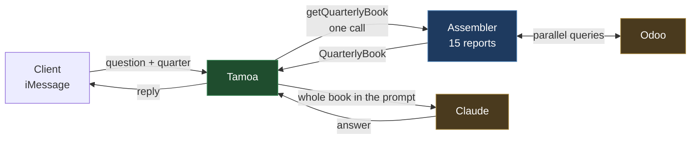
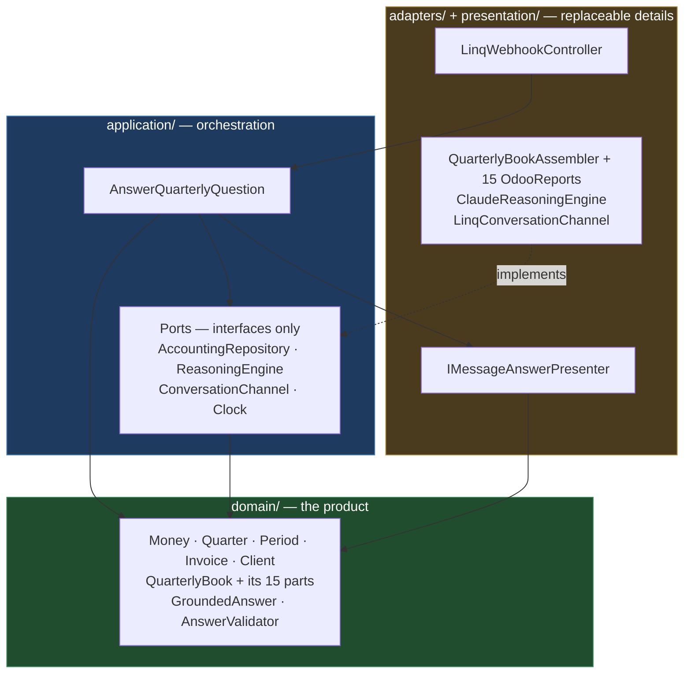
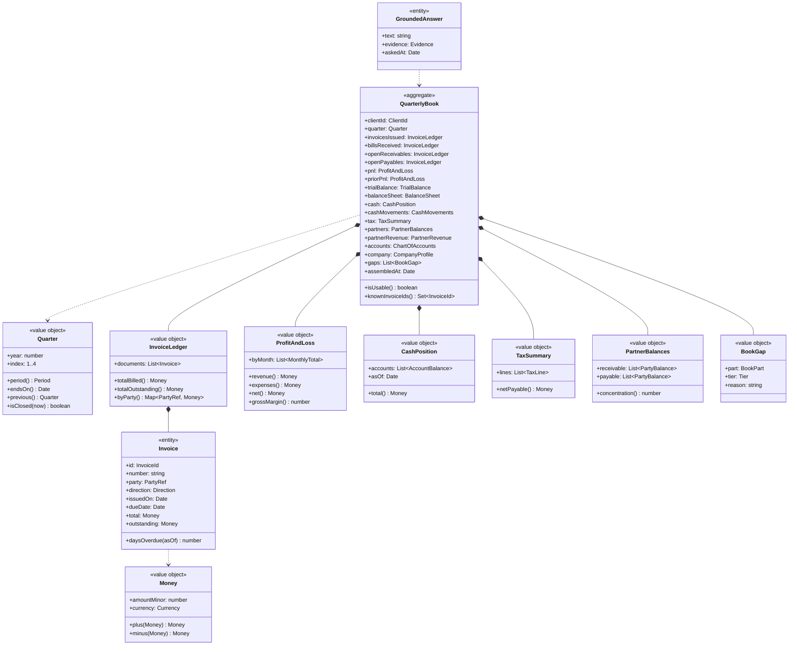
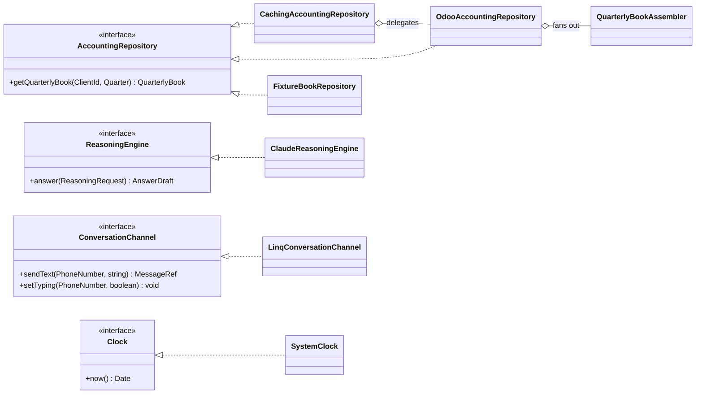
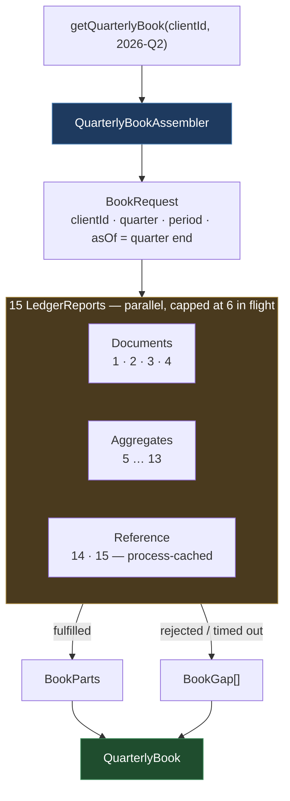
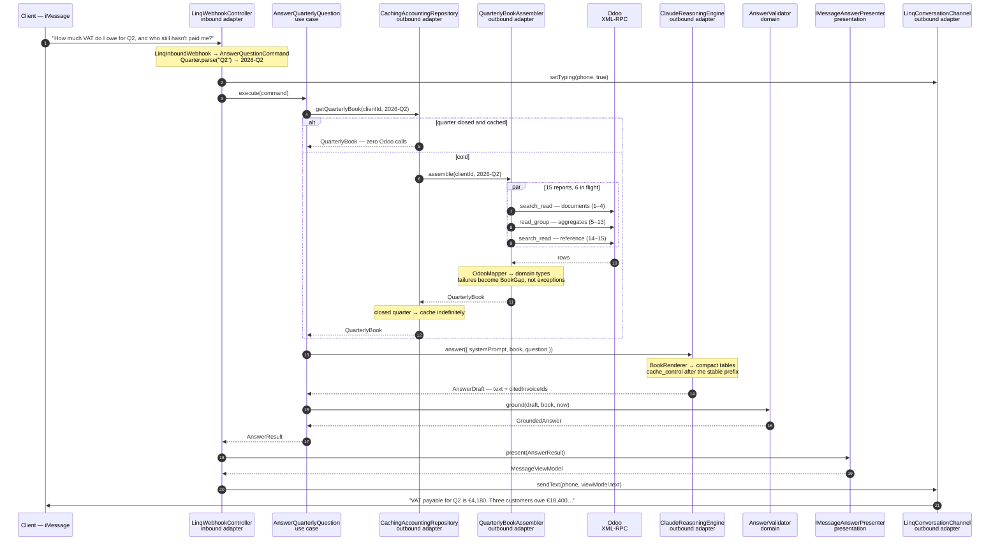

# Architecture — Phase 1

**One flow, end to end: a client texts a question about a quarter, Tamoa assembles that quarter's
complete books out of Odoo, puts them in Claude's context, and answers in the thread.**

Phase 1 is **quarter-scoped by design**. You name a year and a quarter — `2026-Q2` — and Tamoa
returns everything a fractional CFO would want in front of them for that period. No payments, no
expert review, no dashboard, no tool loop.

The end-state design lives in [architecture.md](./architecture.md); stack decisions in
[tech_stack.md](./tech_stack.md). This doc is the subset you build first — same rings, same rules.
Everything cut has a named seam in [§15](#15-seams--what-phase-2-plugs-into).

Runtime: **TypeScript / Node**.

---

## 0. Scope



| In                                                        | Out (Phase 2+)                                      |
| --------------------------------------------------------- | --------------------------------------------------- |
| Inbound Linq webhook → question + `Quarter`                | Payments, checkout, `Engagement` state machine      |
| **One** call → 15 reports assembled into one `QuarterlyBook` | Agentic retrieval / Claude tool loop              |
| Whole book loaded into the prompt                          | Terac expert escalation and review                  |
| One Claude call → one grounded answer                      | Interactive cards, tapbacks, card updates           |
| One reply over Linq (plain text)                           | Mongo persistence, dashboard, conversation history  |
| In-memory client registry                                  | Forecasting, scenarios, anything about *today*      |

**One call per layer.** The controller calls one use case method; the use case makes one port call;
the adapter's assembler fans out across the report catalogue and returns one object. Fan-out lives at
the bottom, where it's a transport concern.

### The two consequences of locking to quarters

**1. A closed quarter never changes — so cache it forever.** This is the big win and it's free.
Q2 2026's books are the same at every reading, which means the assembled `QuarterlyBook` is
cacheable per `(clientId, quarter)`, and the rendered prompt block is a stable
`cache_control` prefix. **Second and later questions about the same quarter cost zero Odoo calls and
hit Claude's prompt cache at ~0.1× input price** ([tech_stack.md §4](./tech_stack.md)). A follow-up
question answers in about a second.

**2. Phase 1 cannot answer about *today*.** Everything point-in-time — cash balance, open
receivables — is **as of quarter end**, not as of now. Ask "how much is in the bank right now?" for a
quarter that closed six weeks ago and the honest answer is a number from six weeks ago. Say the
as-of date in the reply footer, put it in the prompt, and don't let the model paper over it. Live
balances are one extra query and a Phase 1.5 decision — not a Phase 1 one.

**The bar Phase 1 has to clear:** *anything a founder or their accountant asks when closing a
quarter.* What did we make. Who owes us and how late. What do we owe. How much VAT do we file. Which
customer is 40% of revenue. How does this compare to last quarter. Every one of those comes out of
the catalogue in [§4](#4-the-report-catalogue).

---

## 1. The one rule

> **Business logic depends on nothing. Everything depends on business logic.**



Keep the ESLint `no-restricted-imports` guard from
[architecture.md §1](./architecture.md#1-the-one-rule) — it's a copy-paste and it's what stops
`@anthropic-ai/*` from drifting into `domain/` on hour 30 of a hackathon.

Smoke test: **`domain/` compiles and its tests pass with the network unplugged and no env vars set.**

---

## 2. Module map

```
src/
├── domain/                      ← zero dependencies. Pure TypeScript.
│   ├── model/
│   │   ├── Money.ts             Period.ts  Quarter.ts  Ids.ts
│   │   ├── Invoice.ts           InvoiceLedger.ts
│   │   ├── book/                The 15 parts — one file each
│   │   │   ├── ProfitAndLoss.ts       BalanceSheet.ts    TrialBalance.ts
│   │   │   ├── CashPosition.ts        CashMovements.ts   TaxSummary.ts
│   │   │   ├── PartnerBalances.ts     PartnerRevenue.ts  ChartOfAccounts.ts
│   │   │   └── CompanyProfile.ts
│   │   ├── QuarterlyBook.ts     BookGap.ts  BookPart.ts
│   │   ├── Client.ts
│   │   └── GroundedAnswer.ts    Evidence.ts
│   ├── services/
│   │   ├── AnswerValidator.ts
│   │   └── AgingAnalyzer.ts     ← pure; derives buckets from open invoices
│   └── errors/
│
├── application/                 ← depends on domain only
│   ├── ports/driven/
│   │   ├── AccountingRepository.ts   ReasoningEngine.ts
│   │   └── ConversationChannel.ts    Clock.ts
│   ├── usecases/
│   │   └── AnswerQuarterlyQuestion.ts
│   └── dto/                     AnswerQuestionCommand.ts  AnswerResult.ts
│
├── presentation/
│   ├── presenters/              IMessageAnswerPresenter.ts
│   └── viewmodels/              MessageViewModel.ts
│
├── adapters/
│   ├── inbound/linq/            LinqWebhookController.ts
│   └── outbound/
│       ├── accounting/          LedgerReport.ts            ← the source interface
│       │                        QuarterlyBookAssembler.ts  ← the collector (§7)
│       │                        CachingAccountingRepository.ts
│       ├── odoo/
│       │   ├── OdooXmlRpcClient.ts  OdooMapper.ts
│       │   ├── OdooAccountingRepository.ts
│       │   ├── reports/         ← one file per catalogue entry (§4)
│       │   └── fixtures/        FixtureBookRepository.ts   ← demo insurance
│       ├── claude/              ClaudeReasoningEngine  BookRenderer
│       └── linq/                LinqConversationChannel
│
└── composition/
    ├── container.ts             ← where the 15 reports get registered
    └── server.ts
```

**If a folder names a vendor it's disposable; if it names a financial concept it's precious.**

---

## 3. `Quarter` — the input that defines everything

```ts
// domain/model/Quarter.ts — zero imports
export class Quarter {
  private constructor(readonly year: number, readonly index: QuarterIndex) {} // 1 | 2 | 3 | 4

  static of(year: number, index: QuarterIndex): Quarter;
  static parse(text: string): Quarter | null;   // "2026-Q2", "Q2 2026", "q2"
  static containing(date: Date): Quarter;
  static lastCompleted(now: Date): Quarter;     // ← the default

  period(): Period;          // 2026-04-01 → 2026-06-30
  startsOn(): Date;
  endsOn(): Date;            // the as-of date for everything point-in-time
  previous(): Quarter;       // comparatives
  sameQuarterLastYear(): Quarter;
  isClosed(now: Date): boolean;   // ← gates caching. See §11.
  label(): string;           // "Q2 2026"
}
```

**`Quarter` is a domain type, not two ints passed around.** The moment `year` and `q` travel as loose
arguments, someone builds an off-by-one date range in an adapter and the P&L is quietly wrong by one
day at each end. One class, one set of boundary tests, `endsOn()` used everywhere as the as-of date.

### How the quarter gets chosen

| Input | Resolves to |
|---|---|
| Message contains `Q2 2026`, `2026-Q2`, `Q2` | `Quarter.parse` — bare `Q2` means the most recent Q2 that has closed |
| Message says nothing | `Quarter.lastCompleted(now)` |
| Message names the current, unfinished quarter | Allowed, but the book is partial — a `BookGap` says so |

`Quarter.parse` is pure and lives in domain: *which period the client meant* is a product rule, not a
parsing detail. The inbound adapter calls it and puts the result on the command — it never invents a
date range of its own.

> ⚠️ **Fiscal vs calendar quarters.** Phase 1 assumes calendar quarters (Jan–Mar = Q1). Odoo
> companies carry a fiscal year end (`res.company.fiscalyear_last_month`) that may not be December,
> and if the client's is offset, every period boundary here is wrong. **Check it on day one** —
> `CompanyProfile` (report 14) reads it precisely so this fails loudly rather than silently. The fix
> is a `FiscalCalendar` passed into `Quarter`, roughly 20 lines.

---

## 4. The report catalogue

Fifteen reports. Each is **one class, one query, one part of the book.** Adding a sixteenth is one
file plus one line in the container.

### A. Documents — `search_read` on `account.move`

Invoices and bills *are* journal entries in Odoo — same model, split by `move_type`. Read them at the
**document** layer, never as raw `account.move.line` rows: `amount_residual` and `payment_state`
exist only on the document, and rebuilding "who owes me" from GL lines means reimplementing Odoo's
reconciliation engine.

| # | Report | Odoo domain | Rows | Answers |
|---|---|---|---|---|
| 1 | **CustomerInvoices** | `out_invoice`, `out_refund`, posted, `invoice_date` in quarter | ~120 | What we billed, to whom, when |
| 2 | **VendorBills** | `in_invoice`, `in_refund`, posted, `invoice_date` in quarter | ~120 | What we were billed |
| 3 | **OpenReceivables** | `out_*`, posted, `payment_state not in (paid, reversed)`, `invoice_date <= quarterEnd` | ~40 | Who owed us at quarter end — **no lower date bound** |
| 4 | **OpenPayables** | `in_*`, same shape | ~30 | What we owed |

**Reports 3 and 4 have no start date, and that's the point.** A quarter filter silently drops the
invoice issued 5 months ago that's still unpaid — exactly the one the founder is asking about. AR and
AP are each read twice: what *happened* in the quarter (1–2) and what was still *open* at the end of
it (3–4). Skipping this is the most plausible way Phase 1 gives a confidently incomplete answer.

Aging buckets are **not** a query — `AgingAnalyzer` derives them in domain from reports 3 and 4,
using `quarter.endsOn()` as "now". Pure, instant, testable.

### B. Aggregates — `read_group` on `account.move.line`

Cash and the GL genuinely live at the line level, where a quarter is thousands of rows. `read_group`
makes Odoo sum server-side and hand back tens.

| # | Report | Grouped by | Rows | Answers |
|---|---|---|---|---|
| 5 | **ProfitAndLoss** | `account_type` × `date:month`, income + expense accounts, quarter | ~12 | Revenue, COGS, opex, net — the headline |
| 6 | **PriorQuarterPnL** | same, `quarter.previous()` | ~12 | "Better or worse than last quarter?" |
| 7 | **TrialBalance** | `account_id`, all accounts, quarter movement | ~80 | The general ledger, at usable granularity |
| 8 | **BalanceSheet** | `account_type`, asset/liability/equity, **cumulative to quarter end** | ~10 | Position, not flow |
| 9 | **CashPosition** | `account_id`, `account_type = asset_cash`, **cumulative to quarter end** | ~5 | Bank balance per account |
| 10 | **CashMovements** | `date:month` × `journal_id` on cash accounts, plus the largest individual lines | ~10 + ≤300 | Money actually in and out |
| 11 | **TaxSummary** | `tax_line_id`, lines where `tax_line_id != false`, quarter | ~10 | **VAT/sales tax to file for the quarter** |
| 12 | **PartnerBalances** | `partner_id`, receivable + payable accounts, to quarter end | ~50 | Who owes what, both directions |
| 13 | **PartnerRevenue** | `partner_id`, income accounts, quarter | ~50 | Top customers, concentration risk |

**Report 11 is why quarters are the right unit.** A quarter is a *filing* period in most
jurisdictions — VAT returns are quarterly. "What do I owe the tax office for Q2?" is a question a
fractional CFO is asked constantly and a bookkeeper charges for. It falls straight out of this
catalogue.

**Reports 8, 9 and 12 are cumulative to quarter end; the rest are quarter movement.** Balances are
stock, P&L is flow. Applying a `date >=` filter to a balance produces a plausible-looking wrong
number, which is the worst kind.

### C. Reference — stable, cached, prompt-prefix material

| # | Report | Odoo source | Rows | Answers |
|---|---|---|---|---|
| 14 | **ChartOfAccounts** | `account.account` — code, name, `account_type` | ~150 | The vocabulary the client's books use |
| 15 | **CompanyProfile** | `res.company` — currency, fiscal year end, name | 1 | Currency, and the §3 fiscal-year check |

These two change ~never. Fetch once per process, and put them at the **front** of the prompt behind a
`cache_control` breakpoint — [tech_stack.md §4](./tech_stack.md) already calls the chart of accounts
out as cacheable prefix material.

### What's deliberately excluded

| Not fetched | Why |
|---|---|
| `move_type = 'entry'` as documents | Depreciation, payroll accruals, tax closings. Already in the trial balance as numbers; as documents they're noise that invites the model to editorialise on bookkeeping. |
| Raw `account.move.line` dumps | 1,500–4,000 rows a quarter to say what 80 grouped rows say. |
| `account.payment` records | Cash movements (10) already cover money in/out. Adds a second, subtly different truth. |
| Analytic accounts / projects | Not every client uses them. Phase 2, behind a capability check. |
| Anything dated after quarter end | Phase 1 answers about a quarter. See [§0](#0-scope). |

### One report, in full

They're all this size. ~25 lines, one query, returns a domain type.

```ts
// adapters/outbound/odoo/reports/TaxSummaryReport.ts
export class TaxSummaryReport implements LedgerReport<"tax"> {
  readonly part = "tax" as const;
  readonly tier = Tier.Standard;

  constructor(
    private readonly rpc: OdooXmlRpcClient,
    private readonly mapper: OdooMapper,
  ) {}

  async run({ period }: BookRequest): Promise<TaxSummary> {
    const rows = await this.rpc.readGroup("account.move.line", {
      domain: [
        ["tax_line_id", "!=", false], // the line *is* a tax line, not a taxed line
        ["parent_state", "=", "posted"],
        ["date", ">=", period.from],
        ["date", "<=", period.to],
      ],
      fields: ["balance:sum"],
      groupby: ["tax_line_id"],
    });
    return this.mapper.toTaxSummary(rows);
  }
}
```

### Things that cost a day if you learn them late

- **`amount_residual` is what's still owed; `amount_total` is what was billed.** Conflating them is
  the single most likely wrong-number bug in Phase 1.
- **Income accounts carry a *negative* balance.** Odoo stores credits negative, so
  `revenue = -sum(balance)` and `expenses = +sum(balance)`. Get it backwards and the demo shows a
  business losing money on every sale. Flip the sign once, in `OdooMapper`, never in a report.
- **`account_type` values are version-dependent.** Odoo 17+ uses `account_type` on `account.account`
  (`asset_cash`, `income`, `expense`, `asset_receivable`, `liability_payable`); older versions use
  `user_type_id`. Verify against the real instance before writing the constants.
- **`tax_line_id` ≠ `tax_ids`.** The first marks a line that *is* the tax; the second marks a line
  that *has* tax on it. Summing the wrong one double-counts the whole return.
- **Filter `state = posted`** (`parent_state` on lines). Drafts are not facts, and quoting one in a
  CFO answer is a credibility hit you don't recover from on stage.
- **Include `out_refund` / `in_refund`.** Credit notes reduce the picture; dropping them overstates
  both AR and revenue.
- **Multi-currency:** restrict to company currency, or carry currency through and refuse to sum
  across it. `Money` forces the decision — that's what it's for.

> ⚠️ Odoo external API access varies by version and between Online and self-hosted
> ([tech_stack.md §5](./tech_stack.md)). Verify `search_read` **and** `read_group` against the real
> instance **on day one**. `FixtureBookRepository` exists so discovering it on demo day is survivable.

---

## 5. The domain model



### Four decisions worth defending

**`Money` is never a `number`.** Integer minor units plus a currency. Cutting this is the one
shortcut that reliably bites during a demo.

**Every book part is a domain type, not the adapter's row shape.** `read_group` returns
`{ account_id: [12, "Bank"], balance: -4200.0, __count: 31 }`. That stops at `OdooMapper`.
`CashPosition` speaks `Money` and knows nothing about Odoo, which is what lets `AgingAnalyzer` and
every future domain service consume the book directly.

**`QuarterlyBook` is a value object, not a service.** It's inert — a snapshot of a closed period with
no I/O and no lazy loading. That's what makes it cacheable, serialisable to a fixture, and trivial to
hand a test.

**`QuarterlyBook` is the unit of grounding.** `AnswerValidator` doesn't chase per-figure provenance,
because **the entire evidence set is the thing we put in the prompt**:

```ts
// domain/services/AnswerValidator.ts — zero imports, µs to test
export class AnswerValidator {
  ground(draft: AnswerDraft, book: QuarterlyBook, now: Date): GroundedAnswer {
    if (!book.isUsable()) throw new IncompleteBookError(book.clientId, book.quarter, book.gaps);

    const known = book.knownInvoiceIds();
    const invented = draft.citedInvoiceIds.filter((id) => !known.has(id.value));
    if (invented.length > 0) throw new UngroundedFigureError(invented);

    return new GroundedAnswer(draft.text, Evidence.fromBook(book), now);
  }
}
```

Weaker than the full design's per-figure grounding, and it's the honest Phase 1 trade: **we can prove
the answer only saw real ledger data, not yet that every digit is traceable.**

### `BookGap` and tiers

Fifteen queries mean fourteen ways to be *partly* successful. A blanket failure is the wrong
response to "the tax report timed out" when the question was about AR.

| Tier | Reports | If it fails |
|---|---|---|
| **Required** | P&L, CashPosition, OpenReceivables, CompanyProfile | `isUsable()` false — refuse to answer |
| **Standard** | Invoices, Bills, OpenPayables, TrialBalance, Tax, PartnerBalances | Answer, with the gap stated |
| **Optional** | PriorQuarterPnL, BalanceSheet, CashMovements, PartnerRevenue, ChartOfAccounts | Answer, gap noted quietly |

Gaps are **rendered into the prompt** so the model qualifies its answer, and surfaced in the reply
footer. Silence about missing data is how a CFO product loses trust.

---

## 6. Ports — four interfaces



```ts
// application/ports/driven/AccountingRepository.ts
export interface AccountingRepository {
  getQuarterlyBook(clientId: ClientId, quarter: Quarter): Promise<QuarterlyBook>;
}
```

**One method. Read-only by construction** — no `create`, no `update`, no `postJournalEntry`. The
promise that Tamoa never writes to the ledger ([tech_stack.md §5](./tech_stack.md)) is enforced here
as a *vocabulary*, backed by the read-only Odoo service user. Two layers, the right number for a
claim you make to prospects.

### Why the port is coarse

The instinct from the full design is fifteen fine-grained methods with the use case calling them
all. **Don't, not in Phase 1.**

| | Fine-grained port | **One coarse method** |
|---|---|---|
| Use case | Orchestrates 14 calls, owns concurrency and partial-failure policy | Calls one thing |
| Parallelism | Leaks into `application/` | Stays in the adapter, where transport belongs |
| Caching | Fifteen cache keys | One key: `(clientId, quarter)` — [§11](#11-rendering-and-caching) |
| Fixtures | Fake fifteen methods | Fake one, or load one JSON file |

A port should be phrased at the granularity the use case needs, and Phase 1 needs exactly one thing:
*the client's books for a quarter*. That **is** a domain-level request. Whether it costs one round
trip or fifteen is a fact about Odoo, and facts about Odoo live in the Odoo adapter.

The fine-grained calls still exist — as the fifteen `LedgerReport` classes. Phase 2 promotes the
ones the tool loop needs onto the port; nothing is rewritten, it's exposed.

### The `ReasoningEngine` port — deliberately single-shot

```ts
export interface ReasoningEngine {
  answer(request: ReasoningRequest): Promise<AnswerDraft>;
}

export interface ReasoningRequest {
  systemPrompt: string;  // stable → cache_control breakpoint after this
  book: QuarterlyBook;   // the adapter renders it; the port speaks domain
  question: string;
  effort: "low" | "medium" | "high";
}

export interface AnswerDraft {
  text: string;
  citedInvoiceIds: InvoiceId[];
}
```

No `ToolSpec`, no `ReasoningOutcome` union, no loop. **A tool loop pays for itself when retrieval is
open-ended; here it's a fixed catalogue that always runs, over a period that never changes.** Phase 1
retrieves first and reasons once.

---

## 7. The assembler — the intermediate class

The collector between the catalogue and the agent. It knows how to run reports; it knows nothing
about what any of them mean.



### The source interface

```ts
// adapters/outbound/accounting/LedgerReport.ts — vendor-neutral on purpose
export interface LedgerReport<K extends BookPart> {
  readonly part: K;          // which slot of the book it fills
  readonly tier: Tier;       // Required | Standard | Optional — see §5
  run(request: BookRequest): Promise<BookParts[K]>;
}

export interface BookRequest {
  clientId: ClientId;
  quarter: Quarter;
  period: Period; // quarter.period(), precomputed once
  asOf: Date;     // quarter.endsOn() — every point-in-time report uses this
}
```

`BookParts` is a keyed map type (`{ pnl: ProfitAndLoss; cash: CashPosition; … }`), so
`parts[report.part] = await report.run(req)` type-checks per report. **A report can't write a
`TaxSummary` into the cash slot.**

### The assembler

```ts
// adapters/outbound/accounting/QuarterlyBookAssembler.ts
export class QuarterlyBookAssembler {
  constructor(
    private readonly reports: readonly LedgerReport<BookPart>[],
    private readonly clock: Clock,
    private readonly limits = { concurrency: 6, perReportMs: 8_000 },
  ) {}

  async assemble(clientId: ClientId, quarter: Quarter): Promise<QuarterlyBook> {
    const request: BookRequest = {
      clientId,
      quarter,
      period: quarter.period(),
      asOf: quarter.endsOn(),
    };

    const parts: Partial<BookParts> = {};
    const gaps: BookGap[] = [];

    await mapWithConcurrency(this.reports, this.limits.concurrency, async (report) => {
      try {
        parts[report.part] = await withTimeout(report.run(request), this.limits.perReportMs);
      } catch (error) {
        // One report failing is a gap, not an outage. The domain decides if it's fatal.
        gaps.push(BookGap.from(report.part, report.tier, error));
      }
    });

    return QuarterlyBook.assemble(clientId, quarter, parts, gaps, this.clock.now());
  }
}
```

**Forty lines, and it never mentions a financial concept.** No `if (part === 'tax')`, no ordering
between reports, no knowledge of what any of them return. That's the test of whether the collector is
right: **you could add a report about inventory and not touch this file.**

Three properties worth naming:

- **Concurrency is capped at 6.** XML-RPC has no batching — fifteen reports are fifteen HTTP
  requests, and firing all of them at a small Odoo instance is how you discover its worker pool. Six
  in flight completes the catalogue in about two round trips.
- **Per-report timeout, not a global one.** One slow report shouldn't eat the budget that the other
  fourteen need. A timeout is just another gap.
- **`QuarterlyBook.assemble` is the domain factory** — it decides what a missing Required part means.
  The assembler collects; the domain judges.

---

## 8. The use case

```ts
// application/usecases/AnswerQuarterlyQuestion.ts
export class AnswerQuarterlyQuestion {
  constructor(
    private readonly clients: ClientRegistry,
    private readonly accounting: AccountingRepository,
    private readonly reasoner: ReasoningEngine,
    private readonly validator: AnswerValidator,
    private readonly clock: Clock,
  ) {}

  async execute(cmd: AnswerQuestionCommand): Promise<AnswerResult> {
    const now = this.clock.now();
    const client = this.clients.require(cmd.clientId);

    // The adapter parsed a quarter out of the message, or fell back to the last closed one.
    const quarter = cmd.quarter ?? Quarter.lastCompleted(now);

    // One call. Fifteen reports happen behind it — that's the adapter's business.
    const book = await this.accounting.getQuarterlyBook(client.id, quarter);

    // Retrieve first, reason once. No tool loop in Phase 1 — see §6.
    const draft = await this.reasoner.answer({
      systemPrompt: CFO_SYSTEM_PROMPT,
      book,
      question: cmd.question,
      effort: "high",
    });

    // Guardrail: the answer may only reference documents we actually handed it.
    const answer = this.validator.ground(draft, book, now);

    return AnswerResult.from(answer, book);
  }
}
```

Four statements of substance. **No `axios.`, no `anthropic.`, no XML-RPC, no `Promise.all`** — it
runs in a unit test in milliseconds against in-memory fakes.

Note what *isn't* here: no retry, no timeout, no concurrency cap, no partial-failure branch. Those
are real concerns and they all belong to the assembler, the only component that knows there are
fifteen network calls to fail.

---

## 9. One presenter, and it still earns its keep

A presenter takes a finished result and shapes it for one surface. **It makes no decisions**, never
awaits, never calls a port.

```ts
// presentation/presenters/IMessageAnswerPresenter.ts
export class IMessageAnswerPresenter implements Presenter<AnswerResult, MessageViewModel> {
  constructor(private readonly money: MoneyFormatter) {}

  present(result: AnswerResult): MessageViewModel {
    const { text, quarterLabel, asOf, documentCount, gaps } = result;
    const lines = [
      text,
      "",
      `_${quarterLabel} · ${documentCount} documents · as of ${this.money.formatDate(asOf)}_`,
    ];
    if (gaps.length > 0) lines.push(`_⚠️ couldn't read: ${gaps.join(", ")}_`);
    return { text: lines.join("\n") };
  }
}
```

**The `as of` date is not decoration.** Phase 1 answers about a closed quarter
([§0](#0-scope)), so every balance in that reply is historical. Printing the as-of date is the
difference between a defensible answer and a misleading one — and it's the line that makes the
quarter-scoping read as a deliberate choice rather than a limitation.

Note what the presenter does **not** do: no "if outstanding is high, warn them," and no decision
about whether a gap matters. It renders `result.gaps`; `book.isUsable()` already decided whether
answering was defensible at all.

---

## 10. Data across the boundaries

| #   | Type family        | Created by      | Consumed by      | Phase 1 example                                          |
| --- | ------------------ | --------------- | ---------------- | -------------------------------------------------------- |
| 1   | **Vendor payload** | External API    | Its adapter only | `LinqInboundWebhook`, `OdooMoveRecord`, `read_group` rows |
| 2   | **Command**        | Inbound adapter | Use case         | `AnswerQuestionCommand { clientId, question, quarter? }`  |
| 3   | **Entity / VO**    | Domain, mappers | Everything inner | `QuarterlyBook`, `Quarter`, `Invoice`, `Money`            |
| 4   | **Result DTO**     | Use case        | Presenter        | `AnswerResult { text, quarterLabel, asOf, documentCount, gaps }` |
| 5   | **ViewModel**      | Presenter       | Inbound adapter  | `MessageViewModel { text }`                               |

**No vendor type past hop one.**



### The mapper is the boundary guard

```ts
// adapters/outbound/odoo/OdooMapper.ts
export class OdooMapper {
  toInvoice(record: OdooMoveRecord): Invoice {
    return new Invoice(
      InvoiceId.of(record.id),
      record.name,
      PartyRef.of(record.partner_id[0], record.partner_id[1]),
      Direction.fromMoveType(record.move_type),
      new Date(record.invoice_date),
      new Date(record.invoice_date_due),
      Money.of(record.amount_total, record.currency_id[1]),
      Money.of(record.amount_residual, record.currency_id[1]),
      InvoiceStatus.parse(record.payment_state),
    );
  }

  toProfitAndLoss(rows: ReadGroupRow[], currency: Currency): ProfitAndLoss {
    // Sign flip lives here and nowhere else — income is credit-negative in Odoo. See §4.
    ...
  }
}
```

`snake_case`, `[id, name]` tuples, and Odoo's sign conventions all stop here.

---

## 11. Rendering and caching

### Two cache layers, both unlocked by closed quarters

```ts
// adapters/outbound/accounting/CachingAccountingRepository.ts
async getQuarterlyBook(clientId: ClientId, quarter: Quarter): Promise<QuarterlyBook> {
  const key = `${clientId.value}:${quarter.label()}`;
  const cached = this.store.get(key);
  if (cached) return cached;

  const book = await this.inner.getQuarterlyBook(clientId, quarter);

  // A closed quarter is immutable. An open one is not.
  if (quarter.isClosed(this.clock.now()) && book.gaps.length === 0) {
    this.store.set(key, book);                        // no TTL needed
  } else {
    this.store.set(key, book, { ttlMs: 5 * 60_000 });
  }
  return book;
}
```

1. **Book cache** — skip all fifteen Odoo queries for a quarter already assembled.
2. **Prompt cache** — the rendered book is a stable prefix, so a `cache_control` breakpoint after it
   means follow-up questions read it at ~0.1× input price
   ([tech_stack.md §4](./tech_stack.md)).

**Together, the second question about a quarter costs no Odoo calls and a fraction of the tokens.**
That is a demo where the first answer takes four seconds and every follow-up takes one — which reads
as a much better product than it is.

> Caveat worth one line of code: a closed quarter *can* change if someone posts a backdated entry.
> If that matters, validate the cache with a cheap `search_count` of `account.move` where
> `write_date > book.assembledAt`. Phase 1 can also just accept a stale book for the length of a
> demo — but know which you chose.

### Render order in the prompt

`BookRenderer` (Claude adapter) emits the book in this order, and the order matters:

| Position | Content | Why |
|---|---|---|
| 1 | Company profile, chart of accounts | Stable across every client request → **cache breakpoint here** |
| 2 | Headline: P&L, prior-quarter P&L, cash position, tax | The answer to most questions is in ~40 lines |
| 3 | Aggregates: trial balance, balance sheet, partners | Depth when the question needs it |
| 4 | Document tables: invoices, bills, open AR/AP | Most tokens, least often needed line-by-line |
| 5 | Gaps: "the following could not be read…" | Last thing read before the question |

**Token budget.** Documents dominate: ~310 document rows plus ~250 aggregate rows as compact
pipe-delimited tables lands around **20–30K tokens** against a 1M window. Two orders of magnitude of
headroom — the aggregates are what keep it there, since reports 5–13 replace thousands of GL lines
with tens.

Caps: `MAX_DOCUMENTS = 500` per ledger, `MAX_CASH_LINES = 300`. Over the cap, keep the **largest by
absolute amount** (not the most recent — a CFO question is about the big ones), keep the aggregate
totals, which stay exact, and record a `BookGap`.

---

## 12. Composition root

Exactly one place calls `new`. The report catalogue is a list — **this is the file you edit to add a
report.**

```ts
// composition/container.ts
export function buildContainer(env: Env) {
  const clock = new SystemClock();
  const rpc = new OdooXmlRpcClient(env);
  const mapper = new OdooMapper();

  // The catalogue. Order is irrelevant — the assembler runs them concurrently.
  const reports: LedgerReport<BookPart>[] = [
    new CustomerInvoicesReport(rpc, mapper),   // 1
    new VendorBillsReport(rpc, mapper),        // 2
    new OpenReceivablesReport(rpc, mapper),    // 3
    new OpenPayablesReport(rpc, mapper),       // 4
    new ProfitAndLossReport(rpc, mapper),      // 5
    new PriorQuarterPnLReport(rpc, mapper),    // 6
    new TrialBalanceReport(rpc, mapper),       // 7
    new BalanceSheetReport(rpc, mapper),       // 8
    new CashPositionReport(rpc, mapper),       // 9
    new CashMovementsReport(rpc, mapper),      // 10
    new TaxSummaryReport(rpc, mapper),         // 11
    new PartnerBalancesReport(rpc, mapper),    // 12
    new PartnerRevenueReport(rpc, mapper),     // 13
    new ChartOfAccountsReport(rpc, mapper),    // 14
    new CompanyProfileReport(rpc, mapper),     // 15
  ];

  const live = new OdooAccountingRepository(new QuarterlyBookAssembler(reports, clock));
  const accounting = new CachingAccountingRepository(
    env.USE_FIXTURES ? new FixtureBookRepository(loadFixtureBooks()) : live,
    new InMemoryStore(),
    clock,
  );

  const reasoner = new ClaudeReasoningEngine(
    new Anthropic({ apiKey: env.ANTHROPIC_API_KEY }),
    new BookRenderer(),
  );
  const channel = new LinqConversationChannel(env.LINQ_API_KEY, env.LINQ_PHONE_NUMBER);
  const clients = new InMemoryClientRegistry(loadClientsFromEnv(env));

  const answer = new AnswerQuarterlyQuestion(
    clients, accounting, reasoner, new AnswerValidator(), clock,
  );

  return { answer, channel, presenter: new IMessageAnswerPresenter(new MoneyFormatter()) };
}
```

**`USE_FIXTURES` is the highest-value line in the file.** And a fixture is now trivially producible:
run the assembler once against real Odoo, `JSON.stringify` the book, commit it. **A closed quarter's
book is a perfect fixture, because it's exactly as immutable as the real thing.**

---

## 13. Configuration

```bash
# Claude
ANTHROPIC_API_KEY=
CLAUDE_MODEL=claude-opus-5
CLAUDE_EFFORT=high

# Linq
LINQ_API_KEY=
LINQ_PHONE_NUMBER=
LINQ_WEBHOOK_SECRET=

# Odoo — read-only service user, see tech_stack.md §5
ODOO_URL=
ODOO_DB=
ODOO_USERNAME=
ODOO_API_KEY=

# Phase 1 only
CLIENT_REGISTRY_JSON=      # phone → { clientId, businessName, odooCompanyId }
USE_FIXTURES=false         # run the demo with no live Odoo
REPORT_CONCURRENCY=6       # parallel Odoo calls — see §7
REPORT_TIMEOUT_MS=8000     # per report; a timeout is a gap, not a failure
BOOK_CACHE_ENABLED=true
```

Four secrets to boot. No Stripe, no Terac, no Mongo.

---

## 14. Build order

| #   | Step                                          | Layers built                                                             | Done when                                                |
| --- | --------------------------------------------- | ------------------------------------------------------------------------ | -------------------------------------------------------- |
| 1   | Health check + Linq echo                      | `adapters/inbound/linq`, `LinqConversationChannel`, `composition/`       | Texting the number echoes back                           |
| 2   | `Money`, `Period`, `Quarter`                  | `domain/model` — pure, no I/O                                            | Quarter boundary tests green, network unplugged          |
| 3   | Assembler + **two** reports (P&L, CashPosition) | `LedgerReport`, `QuarterlyBookAssembler`, `OdooXmlRpcClient`, `OdooMapper` | A script prints Q2's revenue and bank balance as `Money` |
| 4   | Verify against Odoo's own UI                  | —                                                                        | **The two numbers match what Odoo reports on screen**    |
| 5   | The remaining 13 reports                      | `adapters/outbound/odoo/reports/`                                        | Full book assembles; gaps empty                          |
| 6   | Claude answers over the book                  | `ReasoningEngine`, `BookRenderer`, `AnswerQuarterlyQuestion`, `AnswerValidator` | A question in → a grounded answer out              |
| 7   | Reply in the thread with the as-of footer     | `IMessageAnswerPresenter`, wiring in `LinqWebhookController`              | **The Phase 1 demo runs end to end**                     |
| 8   | Caching + fixture capture                     | `CachingAccountingRepository`, `FixtureBookRepository`                    | Follow-up questions answer in ~1s; demo runs offline     |

**Step 4 is not optional and it is not a formality.** The sign convention on income accounts
([§4](#things-that-cost-a-day-if-you-learn-them-late)) makes "confidently wrong" the default failure
mode, and a P&L that's negated is worse than one that's missing. Two reports verified against the UI
before writing the other thirteen means you find the convention bug once, not fourteen times.

Steps 3 and 5 before step 6, always. **The unglamorous half is the risky half** — Claude answering
over a JSON fixture works on the first try; Odoo's API is where days disappear.

### Testing follows the rings

| Layer          | Test style                                    | Mocks            | Speed |
| -------------- | --------------------------------------------- | ---------------- | ----- |
| `domain/`      | Plain unit tests — `Quarter` boundaries, `AgingAnalyzer`, `Money` | **Zero** | µs |
| `application/` | Use case tests against a fixture book         | Fakes, not mocks | ms    |
| Assembler      | Fake `LedgerReport`s that throw / hang / succeed | Fakes         | ms    |
| `adapters/`    | One contract test per report against a sandbox | Vendor sandbox  | slow  |

The assembler row is worth calling out: **partial failure is the behaviour most likely to break in
production and it's testable in milliseconds** with three fake reports. Test that a failing Required
report makes `isUsable()` false and a failing Optional one doesn't.

### Where to cut corners

Keep [§1](#1-the-one-rule) (dependency rule), `Money`, `Quarter`, and the presenter. Ship fewer
reports — the catalogue is a list, and eight of them still demo well. Skipping the sign-convention
verification in step 4 is how you lose the demo.

---

## 15. Seams — what Phase 2 plugs into

**None of these modify `AnswerQuarterlyQuestion`'s shape or anything in `domain/model`.**

| Phase 2 feature | Plugs in as | What moves |
|---|---|---|
| A 16th report (inventory, payroll, analytics) | One `LedgerReport` class + one line in `container.ts` | **Nothing else.** The assembler is generic over its sources. |
| Tool loop / agentic retrieval | `ReasoningEngine.answer` → `reason()` with a `ReasoningOutcome` union; add `ToolRegistry` | Use case gains a loop. **Each report becomes a tool** — the catalogue is already the tool list. |
| Live "as of today" answers | A `Period.toDate(now)` variant of the same reports | `Quarter` stops being the only input; reports are unchanged. |
| Multi-quarter / trend questions | Assemble N books, or a `BookSeries` value object | Assembler runs per quarter; caching makes it nearly free. |
| Runway, burn, scenarios | `RunwayCalculator` in `domain/services` | New pure class; `QuarterlyBook` is already its input. |
| Terac expert review | `ExpertPanel` port + `EscalationPolicy` domain service | New use case; `AnswerResult` grows a field. |
| Payments | `PaymentGateway` port + `Engagement` aggregate | New use cases. Phase 1 has no billing concept to unwind. |
| Interactive cards | `ConversationChannel.sendCard` + a second presenter | **New presenter, not a new use case** — the §9 payoff. |
| Dashboard | `adapters/inbound/http` + `DashboardPresenter` | No new business logic, by construction. |
| A second ledger vendor (QuickBooks) | New `LedgerReport` implementations; reuse `QuarterlyBookAssembler` | The assembler is vendor-neutral already — that's why it lives in `accounting/`, not `odoo/`. |

Two checks on whether Phase 1 was built right:

> **Adding a report should not require opening the assembler.**
> **Adding the tool loop should not require opening `domain/`.**
