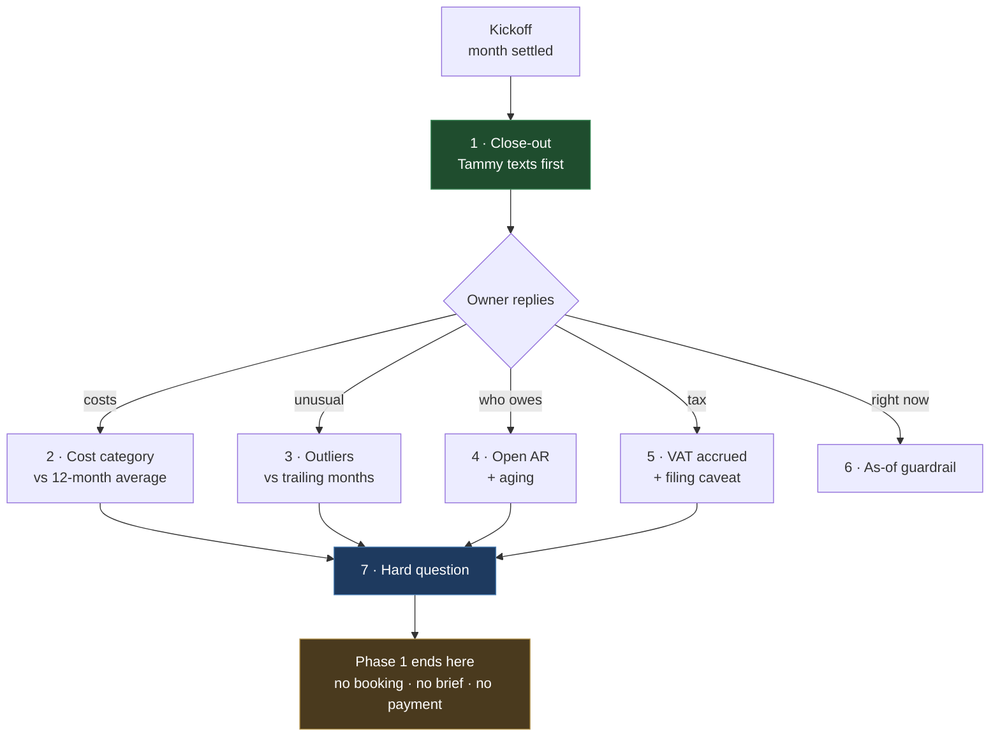

# iMessage flow — Phase 1 (script)

The thread Phase 1 can actually produce, end to end, with **Linq + Odoo + one Claude call** and
nothing else. Numbers in `[brackets]` come from Odoo at runtime — never invent them.

**Naming:** **Tamoa** = the product · **Tammy** = the agent (what the owner texts)

Full end-state script: [imessage_flow.md](./imessage_flow.md) · What's built underneath:
[architecture_phase1.md](./architecture_phase1.md) · Demo arc:
[product_demo.md](./product_demo.md)

**Cadence: monthly.** Tammy opens the thread when a month's books settle — about ten days after
month end ([architecture_phase1.md §3](./architecture_phase1.md#ended-vs-settled)). Every question
in this script resolves to exactly one month.

> Worked example throughout: today is **15 Aug 2026**, so the settled month is **July 2026** and
> every point-in-time figure is **as of 31 Jul 2026**. Swap in your own demo month.

---

## What Phase 1 can and can't say

| Tammy can | Tammy cannot |
|---|---|
| Any number in a settled month's books — P&L, cash, AR/AP, tax, partners, GL | Anything about **today** — live balance, what landed this week |
| Compare with last month, the same month last year, and the trailing 12 | Book a call, send a brief, take payment |
| State runway from cash ÷ trailing burn ([§5](./architecture_phase1.md#5-the-domain-model)) | Forecast, model a scenario, project next month |
| Say plainly what she couldn't read, and when the books were still settling | Reference an earlier message in the thread |
| Show a typing indicator while Odoo and Claude run | React with 👍, mark read, send a card |

Two of those deserve their own rules, because they shape the copy.

### Rule 1 — every turn is stateless

Phase 1 has **no conversation history** ([§0](./architecture_phase1.md#0-scope)): each inbound
message becomes a fresh command, a fresh book and a fresh prompt. So:

- **Owner lines must be self-contained.** "What about the month before?" resolves to nothing.
  "How did June compare with May?" works. The demo cheat sheet below is written this way on purpose.
- **Tammy never says "as I mentioned"** or refers back. Each reply reads as a complete answer.
- A follow-up about the **same** month is nearly free — cached book, cached prompt prefix, ~1s
  ([§11](./architecture_phase1.md#11-rendering-and-caching)). A follow-up about a **different** month
  is a fresh 16-report assemble, ~4s. Order the demo accordingly: two questions about July, then one
  about June if you want to show the cost difference.

### Rule 2 — the footer is part of the product

Every Tammy reply carries the presenter's footer
([§9](./architecture_phase1.md#9-one-presenter-and-it-still-earns-its-keep)):

```
_July 2026 · 87 documents · as of 31 Jul 2026_
```

plus `_books for this month may still be settling_` when the month has ended but not settled, and
`_⚠️ couldn't read: …_` when a report failed. It is shown once in beat 2 below and assumed on every
other Tammy bubble — don't strip it for the camera. It is the line that makes month-scoping read as
a deliberate design choice rather than a limitation.

---

## Beat map

| # | Beat | Who | Book parts it needs | Reports |
|---|---|---|---|---|
| 1 | Monthly close-out | Tammy | P&L, trailing 12, cash, runway, partners | 5, 6, 9, 13 |
| 2 | Dig-in — costs | Owner → Tammy | Trial balance, per-cost history, bills | 7, 16, 2 |
| 3 | Dig-in — what's unusual | Owner → Tammy | Per-cost history, trailing 12 | 16, 6 |
| 4 | Dig-in — who owes me | Owner → Tammy | Open receivables + `AgingAnalyzer` | 3 |
| 5 | Dig-in — tax accrued | Owner → Tammy | Tax summary | 11 |
| 6 | Guardrail — "right now" | Owner → Tammy | Cash position, as-of date | 9 |
| 7 | The ceiling — hard question | Owner → Tammy | Trailing 12, cash, runway | 6, 9 |

Beats 2–5 are interchangeable and any **two** carry the demo. Beat 7 is where Phase 1 stops and says
so, which is the point of it.



---

## Script

### 1 — Tammy: the monthly close-out

Agent-initiated. Everything here is a number or a ratio out of the book — no adjectives the ledger
can't support.

```
Hey — it's Tammy, your fractional CFO from Tamoa. July's books have settled, so here's your month.

Revenue: $[REVENUE] ([REV_DELTA]% vs June)
Net: $[NET]
Cash at 31 Jul: $[CASH]
Runway: ~[RUNWAY] months at your last 3 months' burn

Watching: [TOP_RISK]

Want me to dig into anything — costs, who still owes you, tax?
```

**`[TOP_RISK]` must come out of the book, not out of the model's imagination.** Three grounded
shapes, in order of preference:

| Shape | Source | Example copy |
|---|---|---|
| Concentration | PartnerRevenue (13) | `[PARTY] was [PCT]% of July revenue` |
| Overdue AR | OpenReceivables (3) + `AgingAnalyzer` | `$[AMT] of receivables are 60+ days out` |
| Trend | TrailingByCategory (16) — the line's own rising streak | `[CATEGORY] has risen three months running` |

If none of the three clears a threshold, say so — `Nothing in July looks out of pattern` is a
perfectly good line and a far better one than a manufactured worry.

> **Implementation note.** The architecture is webhook-driven; this beat is the one outbound trigger.
> One internal route or CLI script in `composition/` calls `AnswerMonthlyQuestion` with a canned
> close-out question and sends the result over `ConversationChannel`. **No new use case, no new
> business logic** — same path as every other beat, different entry point.

### 2 — Owner: dig-in on costs

```
Owner: What was my biggest cost in July?
```

**Linq:** `setTyping(true)` while the book assembles, then send.

```
Biggest expense line in July was [COST_CATEGORY] — $[AMOUNT], [PCT]% of the month's expenses.

Largest single bill in it: [VENDOR] [INVOICE_NO], $[LINE_AMOUNT].

Against the last 12 months that's [in line / high] — your monthly average for [COST_CATEGORY] is $[AVG].

_July 2026 · [N] documents · as of 31 Jul 2026_
```

**The third line is the monthly cadence earning its keep.** A single month's cost figure invites the
wrong reaction; the same figure against a twelve-month average is a finding. That average is
per-category, so it comes from **report 16**, which holds each cost line's own twelve months
([§4](./architecture_phase1.md#b-aggregates--readgroup-on-accountmoveline)) — report 6 groups by
account *type* and can only compare total expenses, which is a different and much weaker sentence.

### 3 — Owner: dig-in on what's unusual

```
Owner: Anything unexpected vs the last few months?
```

```
Two things stand out:

• [UNEXPECTED_ITEM] — $[AFTER] in July against a $[AVG] monthly average
• [TREND_ITEM] has climbed three months running: $[M1] → $[M2] → $[M3]

Everything else sits inside its normal range. Revenue is [up/down] [REV_DELTA]% on June and [YOY_DELTA]% against July last year.
```

*(If nothing is unusual, say that plainly — still grounded in the trailing series.)*

> ⚠️ **The one thing to get right in this beat.** A single large annual bill — insurance, a tooling
> renewal — booked whole into July makes July look broken, and in a quarterly view it would have
> averaged out. The prompt must make the model check any spike against the same line in prior months
> before calling it a problem, and say `one-off` when the trailing series shows it as one. This is
> the characteristic failure mode of monthly reporting
> ([§4](./architecture_phase1.md#things-that-cost-a-day-if-you-learn-them-late)).
>
> It is not left to the prompt alone. Report 16 carries, per line, **how many of the trailing months
> it moved at all** — an annual premium is 1 of 12, payroll is 12 of 12 — so `one-off` is a fact read
> off the book rather than a judgement the model makes about a big number.

### 4 — Owner: who owes me

The strongest Phase 1 beat — it's the question a founder actually asks, and reports 3 + `AgingAnalyzer`
answer it exactly.

```
Owner: Who still hasn't paid me?
```

```
At 31 Jul, $[AR_TOTAL] was open across [N] invoices:

• [PARTY_1] — $[AMT_1], [DAYS_1] days past due ([INV_1])
• [PARTY_2] — $[AMT_2], [DAYS_2] days past due ([INV_2])
• [PARTY_3] — $[AMT_3], not due yet

$[AR_60_PLUS] of that is 60+ days out[, all of it [PARTY_1]].
```

Note the open receivables have **no lower date bound** — the invoice from five months ago that's
still unpaid is in here, and it's usually the one that matters.

### 5 — Owner: tax

```
Owner: How much VAT did July accrue?
```

```
July accrued $[TAX_NET] net VAT — $[TAX_OUT] charged on sales, $[TAX_IN] reclaimable on purchases.

One caveat worth saying out loud: that's the month, not a return. If you file quarterly, your filing covers [MONTHS] — ask me for each month and add them, and check with your bookkeeper before you submit.
```

**Do not let this beat drop the caveat.** A monthly accrual presented as a filing figure is the one
error in this script that costs the client money rather than credibility
([§4](./architecture_phase1.md#b-aggregates--readgroup-on-accountmoveline)).

### 6 — Owner: "right now" (the guardrail beat)

Worth demoing deliberately. It's the moment the product looks *more* trustworthy, not less.

```
Owner: How much is in the bank right now?
```

```
I read closed books, so the honest answer is $[CASH] as of 31 Jul — about two weeks ago. Whatever's moved since isn't in front of me.

August settles in [N] days and I'll text you then.
```

Phase 1 answers about a settled month, full stop
([§0](./architecture_phase1.md#0-scope)). Monthly keeps that gap at a few weeks instead of a
quarter — small enough to state and move on.

### 7 — Owner: the hard question (where Phase 1 stops)

```
Owner: I'm thinking about hiring an engineer at ~$[MONTHLY]/mo. Can I afford it?
```

```
Here's what your books say, and where they stop.

Your last three months averaged $[AVG_NET] net, and you had $[CASH] at 31 Jul. A $[MONTHLY]/mo hire is [PCT]% of that burn — on today's numbers it takes runway from ~[RUNWAY] months to roughly ~[RUNWAY_AFTER].

What I can't tell you: what's landed since 31 Jul, what your pipeline does from here, or how fast you'd cut if revenue slips. Afford-versus-raise turns on those, and it's a judgment call rather than a division.

Want me to pull June and May so you can see whether that burn is steady or drifting?
```

Three things about this bubble:

- **The arithmetic is real and allowed.** Runway and the post-hire figure are pure domain
  calculations over data already in the book ([§5](./architecture_phase1.md#5-the-domain-model)) —
  backward-looking, no assumptions. `[RUNWAY_AFTER]` is cash ÷ (burn + hire cost), and it must be
  described as "on today's numbers", never as a projection.
- **The closing offer is genuinely Phase 1.** "Pull June and May" is two more single-month questions,
  each its own book, each cached — not a `BookSeries`, not forecasting. It gives the demo somewhere
  to go without crossing the line.
- **This is the end of the Phase 1 thread.** No CFO offer, no hire-profile ask, no booking link, no
  brief, no payment. If it feels like the conversation wants to continue here — good. That's the
  Phase 2 seam doing its job, and it's a fine note to end a demo on.

---

## Failure-path copy

These are user-visible strings; write them now rather than at 3am. All of them are grounded in
[§5](./architecture_phase1.md#bookgap-and-tiers).

| Situation | What Tammy sends |
|---|---|
| **Required** report failed — `isUsable()` false | `I couldn't get a complete read of your July books — [WHAT] didn't come back. I'd rather not answer on a partial ledger. Try me again in a minute?` |
| **Standard** gap, e.g. tax timed out | Answer normally, then `I couldn't pull the tax lines this time, so nothing on VAT above.` + footer warning |
| **TrailingMonths** gap | Answer normally, then `I couldn't pull the last 12 months, so this is July on its own — no comparison and no runway figure.` |
| Month ended but not settled | Answer normally, then `Heads up: July's books are still settling, so late bills could still move these.` |
| Current, unfinished month | `August isn't done — this is the month so far, through [TODAY].` |
| Model cited an invoice not in the book (`UngroundedFigureError`) | **Never send the draft.** Retry once; if it fails again: `Something's off in how I read that — let me come back to you rather than give you a number I can't stand behind.` |
| Sender not in the client registry | `I don't have books linked to this number yet.` |
| Month predates the client's ledger | `Your Odoo books don't go back to [MONTH] — earliest I can see is [FIRST_MONTH].` |

**The pattern in all of them:** say what's missing, say what it costs the answer, don't fill the gap.
Silence about missing data is how a CFO product loses trust — and a confident wrong number is worse
than a hedge.

---

## Demo actor cheat sheet (Owner only)

Self-contained by design — Phase 1 has no memory ([Rule 1](#rule-1--every-turn-is-stateless)). Say
any two or three, then the last one.

1. `What was my biggest cost in July?`
2. `Anything unexpected vs the last few months?`
3. `Who still hasn't paid me?`
4. `How much VAT did July accrue?`
5. `How much is in the bank right now?` *(the guardrail beat — worth including)*
6. `I'm thinking about hiring an engineer at ~$X/mo. Can I afford it?`

Keep 1 and 2 both about July: the second answer comes back in about a second off the cache, and the
speed difference is visible on camera.

---

## Placeholders to fill

| Token | Source | Report |
|---|---|---|
| `[REVENUE]`, `[NET]` | ProfitAndLoss | 5 |
| `[REV_DELTA]`, `[YOY_DELTA]`, `[M1..M3]`, `[AVG_NET]` | TrailingMonths | 6 |
| `[AVG]` — a **category's** monthly average, and its months-active and rising streak | TrailingByCategory | 16 |
| `[CASH]` | CashPosition, as of month end | 9 |
| `[RUNWAY]`, `[RUNWAY_AFTER]` | `RunwayEstimator` — cash ÷ trailing burn | 6 + 9 |
| `[COST_CATEGORY]`, `[AMOUNT]`, `[PCT]` | TrialBalance / ProfitAndLoss | 7, 5 |
| `[VENDOR]`, `[INVOICE_NO]`, `[LINE_AMOUNT]` | VendorBills | 2 |
| `[AR_TOTAL]`, `[PARTY_n]`, `[AMT_n]`, `[DAYS_n]`, `[INV_n]`, `[AR_60_PLUS]` | OpenReceivables + `AgingAnalyzer` | 3 |
| `[TAX_NET]`, `[TAX_OUT]`, `[TAX_IN]` | TaxSummary — **accrued, not filed** | 11 |
| `[TOP_RISK]` | PartnerRevenue / aging / trend — see beat 1 | 13, 3, 6 |
| `[N] documents`, `as of`, settling flag | `AnswerResult` → presenter footer | — |

**Every token in this table has a report number.** That's the test: a placeholder with no source is a
number Tammy would have to invent, and it doesn't belong in the script.

---

## Build order — which beats light up when

Mapped to [architecture_phase1.md §14](./architecture_phase1.md#14-build-order).

| After arch step | What you can demo |
|---|---|
| 1 — Linq echo | Nothing yet; the thread exists |
| 3 — P&L + CashPosition verified | Beat 1 without runway or the delta: revenue, net, cash |
| 5 — TrailingMonths + RunwayEstimator | **Beat 1 in full** |
| 6 — remaining reports, including **16 (TrailingByCategory)** | Beats 2 and 3 — each cost against its own history — then 4 and 5 |
| 7–8 — Claude + presenter wired | The whole script, footer included, end to end |
| 9 — caching + settling | Follow-ups in ~1s; the settling line; offline demo on fixtures |

If the clock runs out, **beats 1 + 4 + 7 are the demo**: proactive close-out, a hard ledger question
answered exactly, and an honest ceiling. Everything else is depth.

---

## What's cut, and where it comes back

Beats 8–12 of the [full script](./imessage_flow.md) are all Phase 2, and each has a named seam in
[§15](./architecture_phase1.md#15-seams--what-phase-2-plugs-into).

| Full-script beat | Why it's out of Phase 1 | Comes back as |
|---|---|---|
| 👍 tapback, read receipts | `ConversationChannel` has `sendText` + `setTyping` only | `sendCard` + channel methods |
| Hire-profile ask, CFO offer | No engagement state, no memory between turns | `Engagement` aggregate |
| Cal.com booking link | No scheduling concept | Phase 2 booking |
| Graphical brief URL | No web surface, no persistence | `adapters/inbound/http` + `DashboardPresenter` |
| Payment link | No `PaymentGateway` port | Linq payment requests ([architecture.md §9](./architecture.md)) |
| Before → after on expert feedback | No Terac escalation, no stored prior answer | `ExpertPanel` port + `EscalationPolicy` |

**None of these require reopening `domain/` or changing `AnswerMonthlyQuestion`'s shape.** That's the
whole reason Phase 1 is allowed to be this small.
